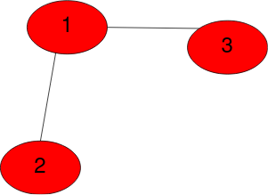
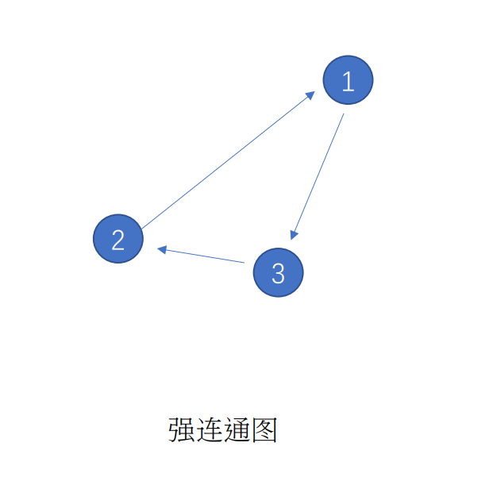
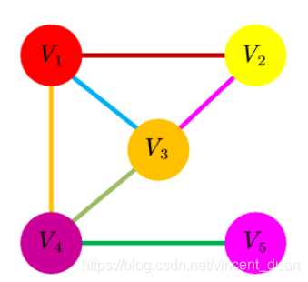
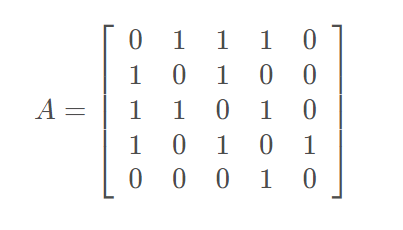
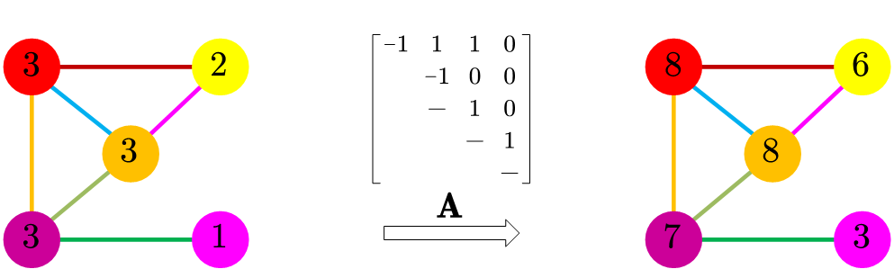
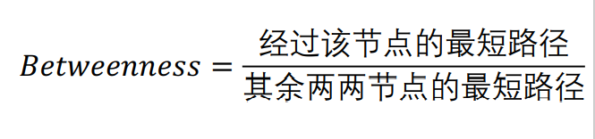
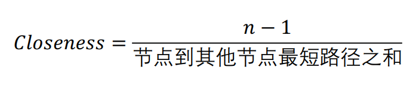
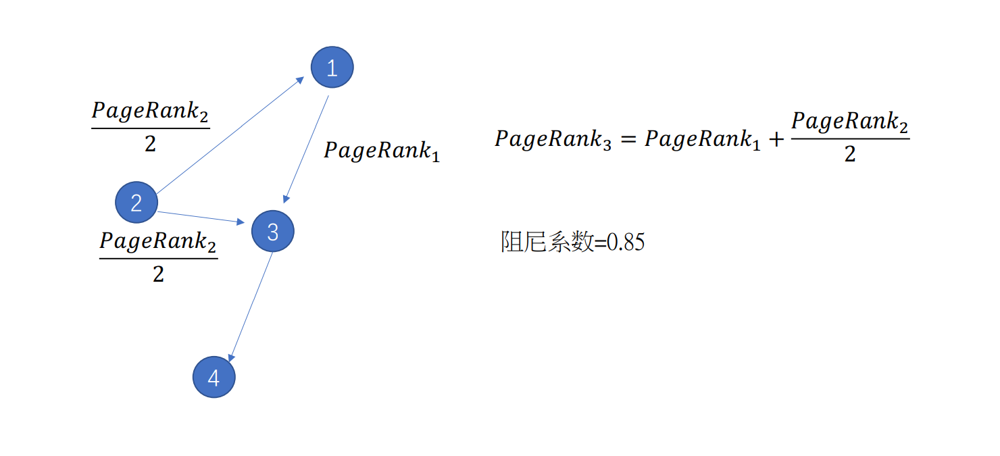
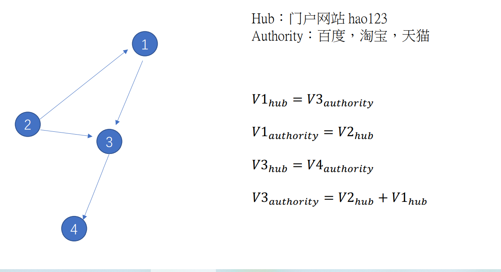

# 1. Graph基本介绍

图是由映射到一组边的一组节点/顶点组成的结构。 

这些单词本身会给您一个提示。 节点/顶点是图形上的一个点，边通过线段将两个顶点连接在一起。 我们用=> **edge =（u，v）**表示连接一对顶点的**边**

下图表示具有**3**个顶点和**2个**边的Graph。 我们不需要将图中的所有顶点连接在一起。



## 1.1 图的表示

- 无向图

- 有向图

- 邻接矩阵

- 图的性质：度（degree）

  有向图：出度、入度

## 1.2 图的特征

- 子图 Subgraph

  子图所有节点和边都在大图中存在

- 连通图 Connected Graph　＆　连通分量 Connected Component

  - 无向图

    - 连通图：任意节点i 可以通过一些边j 可达
    - 连通分量：无向图 G的一个极大连通子图称为 Ｇ的一个连通分量（连通分支）。连通图只有一个连通分量，即自身；非连通的的无向图有多个连通分量

  - 有向图

    - 强连通图：给定有向图$Ｇ=(Ｖ,Ｅ)$，并且给定该图Ｇ中的任意两个结点ｕ和ｖ，如果结点ｕ和结点ｖ相互可达，即至少存在一条路径可以从结点ｕ开始，到结点ｖ终止，同时存在至少一条路径可以由结点ｖ开始，到结点ｕ终止，那么就称该有向图Ｇ是**强连通图**。

      

    - 弱连通图：若至少有一对结点不满足单向连通，但是去掉方向从无向图的观点看是连通图，则Ｄ称为弱连通图。
    
    - 周期性图：假设$k$的自然数，如果从有向图的一个结点出发返回到这个结点的路径的长度都是$k$的倍数，那么称这个结点为周期性结点。 如果一个有向图不含有周期性结点，则称这个有向图为非周期性图 （aperiodic graph)，否则为周期性图。

- 最短路径 Shortest Path

  - 两个结点所达到的最短路径

- 图直径 Diameter

  - 图中两两结点最短路径中最长的路径为图直径

## 1.3 图中心性 Centrality

### 度中心性 Degree Centrality

```
度中心性的基本思想：重要的节点就是拥有许多连接的节点。你的社会关系越多，你的影响力就越强。
整个网络一共有n个节点，意味着每个人最多可以有n-1个社会关系
```

$$
DC_i=\frac{N_{degree}}{n-1}
$$

其中

- $N_{degree}$表示该节点$i$的度

- $n$表示节点的数量

### 特征向量中心性 Eigenvector Centrality

```
特征向量中心性的基本思想是，一个节点的中心性是相邻节点中心性的函数。也就是说，与你连接的人越重要，你也就越重要。
特征向量中心性和点度中心性不同，一个点度中心性高即拥有很多连接的节点，但特征向量中心性不一定高，因为所有的连接者有可能特征向量中心性很低。
同理，特征向量中心性高并不意味着它的点度中心性高，它拥有很少但很重要的连接者也可以拥有高特征向量中心性。
```

$$
EC_i=x_i=c\sum_{j=1}^n{a_{ij}x_j}
$$

其中

- c为一个比例常数
- 记$x=[x_1,x_2,...,x_n]^T$

经过多次迭代到达稳定时，可以写成如下矩阵形式
$$
x=cAx
$$
这里x是矩阵A关于$c^{-1}$对应的特征向量，也可以表示：
$$
Ax=\lambda x
$$
eg.

考虑下面的图，以及相应的$5×5$的邻接矩阵(Adjacency Matrix)，A。





现在考虑x，一个5x1的向量，向量的值对应图中的每个点。

在这种情况下，我们计算的是每个点的点度中心性（degree centrality），即以点的连接数来衡量中心性的高低。

矩阵A乘以这个向量的结果是一个5x1的向量：
$$
Ax
$$
结果向量的第一个元素是用矩阵A的第一行去“获取”每一个与第一个点有连接的点的值（连接数，点度中心性），也就是第2个、第3个和第4个点的值，然后将它们加起来。

换句话说，邻接矩阵做的事情是将相邻节点的求和值重新分配给每个点。这样做的结果就是“扩散了”点度中心性。你的朋友的朋友越多，你的特征向量中心性就越高。



```
我们继续用矩阵A乘以结果向量。
实际上，我们允许这一中心性数值再次沿着图的边界“扩散”。我们会观察到两个方向上的扩散（点既给予也收获相邻节点）。
我们猜测，这一过程最后会达到一个平衡，特定点收获的数量会和它给予相邻节点的数量取得平衡。
既然我们仅仅是累加，数值会越来越大，但我们最终会到达一个点，各个节点在整体中的比例会保持稳定。
图中的点存在一个数值集合，对于它，用矩阵A去乘不会改变向量各个数值的相对大小。也就是说，它的数值会变大，但乘以的是同一个因子。
满足这一属性的向量就是矩阵M的特征向量。特征向量的元素就是图中每个点的特征向量中心性。
```

### 中介中心性 Betweenness Centrality

```
中介中心性的思想是：如果一个成员位于其他成员的多条最短路径上，那么该成员就是核心成员，就具有较大的中介中心性.
```

$$
BC=\sum{\frac{d_{st}()}{d_{st}}}
$$

其中

- $d_{st}$表示s到t的最短路径数量
- $d_{st}()$表示从s到t的最短路径中经过节点的数量
- 若需要进行标准化，在如上公式基础上，除以（n-1)(n-2)，n为节点数量

- 

### 连通中心性 Closeness Centrality

```
反映在网络中某一节点与其他节点之间的接近程度。如果一个节点离其他的节点都很近，那么传递信息的时候就不需要依赖其他的节点，说明这个节点很重要。
相比中介中心性，接近中心性更接近几何上的中心位置。
接近中心性高的节点一般扮演的是八婆的角色（gossiper）。他们不一定是名人，但是乐于在不同的人群之间传递消息。
```

$$
d_i=\frac{1}{n-1}\sum_{j\neq i}d_{ij}\\CC_i=\frac{1}{d_i}=\frac{n-1}{\sum_{j\neq i}d_{ij}}
$$

```
这个点的紧密中心性是基于该节点到网络中其余所有节点的最短路径之和
如果进行归一化处理，就是求这个节点到其他所有节点的平均最短距离
一个节点的平均最短距离越小，那么这个进行的紧密中心性就越大。
如果节点i和节点j之间没有路径可达，则定义dij为无穷大，其倒数为0.
```

- 

## 1.4 网页排序算法

### Page Rank

```
PageRank的思想认为，指标最好还需要考虑到指向你的那些网页。
也就是说，来自受欢迎的网页的跳转应该重于不太受欢迎的网页的跳转。
这就是PageRank思想的精华，Google就是利用这一思想来给网站排名的。
这里的思想依据和特征向量中心性其实是一致的。
直观上，一个网页，如果指向该网页的超链接越多，随机跳转到该网页的概率也就越高，该网页的PageRank值就越高，这个网页也就越重要。一个网页，如果指向该网页的PageRank值越高，随机跳转到该网页的概率也就越高，该网页的PageRank值就越高，这个网页也就越重要。
PageRank值依赖于网络的拓扑结构，一旦网络的拓扑(连接关系)确定，PageRank值就确定
PageRank 的计算可以在互联网的有向图上进行，通常是一个迭代过程。先假设一 个初始分布，通过迭代，不断计算所有网页的PageRank值，直到收敛为止。
```

- 马尔科夫链

给定一个含有$n$个结点的有向图，在有向图上定义随机游走（ random walk)模型，即一阶马尔可夫链。也就是说，随机游走者每经一个单位时间转移一个状态，如果当前时刻在第$j$个结点（状态），那么下一个时刻在第$i$个结点（状态）的概率是$m_{ij}$这一概率只依赖于当前的状态，与过去无关，具有马尔可夫性。

- 转移矩阵

转移矩阵是一个$n$阶矩阵$M$
$$
M=[m_{ij}]_{n×n}
$$
其中，第$i$行第$j$列元素$m_{ij}$取值格则如下：如果结点$j$有$k$个有向边连出，并且结点$i$是其连出的一个节点，则$m_{ij}=\frac{1}{k}$;否则$m_{ij}=0，i,j=1,2,3,...,n$。

即每个元素非负，每列元素之和为$1$即矩阵$M$为随机矩阵（stochastic matrix)。

随机游走在某个时刻$t$访问各个结点的概率分布就是马尔可夫链在时刻$t$的状态分布，可以用一个 $n$ 维列向量 $R_t$ 表示，那么在时刻 $t+1$ 访问各个结点的概率分布 $R_{t+1}$ 满足
$$
R_{t+1}=MR_t
$$

- RageRank基本定义

给定一个包含 $n$ 个结点的强连通且非周期性的有向图，在其基础上定义随机游走模型。假设转移矩阵为 $M$ ， 在时刻 $0,1,2,...,t,...$ 访问各个结点的概率分布为
$$
R_0,MR_0,M^2R_0,...,M^tR_0,...
$$
则极限
$$
\lim_{t\to +\infty}M^tR_0=R
$$
存在，期限向量$R$表示马尔可夫的平稳分布，满足
$$
MR=R
$$
平稳分布$R$称为这个有向图的RageRank。$R$的各个分量为各个结点的RageRank值。

不可约且非周期的有限状态马尔可夫链，有唯一平稳分布存在，并且当时间趋于无穷时状态分布收敛于唯一的平稳分布。

- PageRank的一般定义

PageRank 一般定义的想法是在基本定义的基础上导入平滑项。

给定一个含有 $n$ 个结点  $v_i$，$i=1,2,3...,n$  ，的任意有向图，假设考虑一个在图上随机游走模型，即一阶马尔可夫链，其转移矩阵是 $M$ ，从一个结点到其连出的所有结点的转移概率相等。 这个马尔可夫链未必具有平稳分布。 

假设考虑另一个完全随机游走的模型，其转移矩阵的元素全部为 $\frac{1}{n}$ ， 也就是说从任意一个结点到任意一个结点的转移概率都是 $\frac{1}{n}$ 。 两个转移矩阵的线性组合又构成一个新的转移矩阵，在其上可以定义一个新的马尔可夫链。 容易证明这个马尔可夫链一定具有平稳分布，且平稳分布满足
$$
R=(dM+\frac{1-d}{n}E)R\\=dMR+\frac{1-d}{n}1
$$
其中$d(0<=dM<=1)$是系数，称为阻尼系数（damping factor），E是全为1的矩阵，R是n维向量，1是分量全为1的n维向量，R 表示的就是有向图的一般PageRank。

式中第一项表示（状态分布是平稳分布时）依照转移矩阵 $M$ 访问各个结点的概率，第二项表示完全随机访问各个结点的概率。阻尼因子 $d$ 取值由经验决定，例如 $d=0.85$ 。当 $d$ 接近 $1$ 时，随机游走主要依照转移矩阵 $M$ 进行；当 $d$ 接近 $0$ 时，随机游走主要以等概率随机访问各个结点。

第二项称为平滑项，由于采用平滑项，所有结点的 PageRank 值都不会为 0



### HITS



