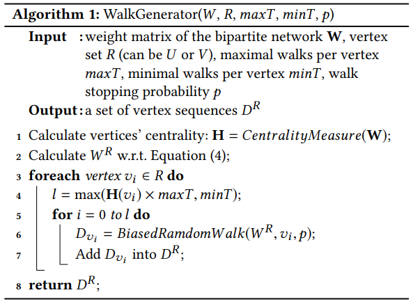
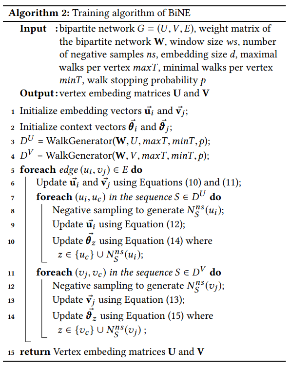

# 10. BiNE

当前的许多网络表示学习方法主要是针对同质网络的，忽略了二部图的特殊性质。本文提出一种的专门**针对二部图的网络表示学习方法**。通过有偏随机游走，生成的节点序列很好地保留节点在原始二部图中的长尾分布。本文基于节点的显式联系和隐式联系，提出一种新的优化方法。

传统NE方法对于二部图而言不是最优的理由：

- 没有考虑节点类型。与同质网络不同，二部图中有两种类型节点，虽然同类型节点之间不存在边，但是具有隐式联系。传统的随机游走方法虽然能够捕捉高阶隐式联系，但是不够高效。
- 产生的序列可能无法保留二部图的特性。例如经过deepwalk随机游走采样后的序列，节点度并不满足幂律分布。而幂律分布是二部图的一个重要特性。

## 10.1、模型

### 总体流程

1. 通过原始二部图分别生成U和V两张图
2. 在U和V上分别进行有偏随机游走，得到序列$D^U,D^V$
3. SGA更新代表节点$u_i$和$v_i$的embedding向量$\vec{u}_i$和$\vec{v}_j$

我们定义一个二部图$G=(U,V,E)$，其中U和V分别代表两种类型节点集合。$E\subseteq U\cdot V$表示边，每一条边上都有一个非负的权重$w_{i,j}$，其中$W=[w_{i,j}]\in \R^{\vert U \vert \times \vert V\vert}$。以下使用$\vec{u}_i$和$\vec{v}_j$代表节点$u_i$和$v_i$的embedding向量模型将二部图上的所有节点都映射成一个d维的embedding向量。$f:U\cup V\to \R^d$

### 建模显式关系

二部图中，存在于两种类型节点之间的边提供了显式关系。与LINE建模一阶相似度类似，本文将二部图节点的显式关系建模为两个相连节点的局部相似性，$u_i$和$v_i$的联合概率为（经验分布）：
$$
p(i,j)=\frac{w_{i,j}}{\sum_{e_{i,j}\in{E^{w_{i,j}}}}}
$$
用$u_i$和$v_j$的embedding的内积来估计局部相似性（重建分布）
$$
\hat{p}(i,j)=\frac{i}{1+\exp(-\vec{u}_i^T\vec{v}_j)}
$$
用KL散度衡量两个分布的差异，通过最小化该目标函数，学习得到表示
$$
minimize O_1=KL(P\vert\vert\hat{P})=\sum_{e_{i,j}\in E}P(i,j)\log(\frac{P(i,j)}{\hat{P}(i,j)})\\\propto -\sum_{e_{i,j}\in E}w_{i,j}\log{\hat{P}(i,j)}
$$
以上部分与LINE一阶相似度相同

### 建模隐式关系

两个同类型节点之间没有边直接连接，但是如果存在节点间存在路径，则二者之间存在某种隐式关系；其中路径的数目和长度表明该隐式关系的强度。直接计算两个节点之间的路径计算开销大，在大规模网络中难以实现。本文采用DeepWalk等工作中采用的随机游走策略。具体地，首先通过执行随机游走将二分图转换为两个顶点序列语料库; 然后从语料库中学习嵌入。

#### 构建节点序列语料库

由于周期性的原因，二分图上没有静态的随机游走分布，所以直接在二分图上执行随机游走可能失败。为了解决该问题，我们考虑在两个具有同类型节点二阶节点相似度的同质图上进行随机游走。

定义两个节点的二阶相似度如下：
$$
w_{i,j}^U=\sum_{k\in V}{w_{i,k}w_{j,k}};\quad w_{i,j}^V=\sum_{k\in U}w_{k,i}w_{k,j}
$$
相当于$w^U_{ij}=w_i\cdot w_j$；使矩阵$W^U=[w_{ij}^U]\in \R^{\vert U\vert \times\vert U\vert}$和$W^V=[w_{ij}^V]\in \R^{\vert V\vert \times\vert V\vert}$分别表示两个同质网络。

此时可以使用截断随机游走分别生成两个语料以训练得到高阶隐式关系。但是为了保留真实二部图的节点分布特征，本文提出使用一种**有偏、自适应的随机游走方法。**

##### 随机游走

1. **从某个节点开始进行随机游走的次数，与该节点的重要性正相关**。节点重要性可由中心度（centrality）衡量
2. **设置每一步随机游走停止的概率**。deepwalk及其他方法中使用的是固定长度的游走序列，本文的游走序列是可变长度的，目的是为了与自然语言中句子长度可变的事实更接近。

具体算法如下：

#### 建模隐式关系

隐式关系与LINE二阶相似度定义相同，如果两个节点上下文相似，则两个节点存在隐式关系。

二部图中有U和V两种节点，其中以U为例，令$D^U$为U节点序列构成的语料，$D_S(u_i)$代表节点$u_i$的上下文节点；最大化下列条件概率：
$$
maximizeO_2=\prod_{u_i\in S\cup S\in D^U}\prod_{u_c \in C_S(u_i)}P(u_c|u_i)
$$
体力对于V节点
$$
maximizeO_3=\prod_{v_j\in S\cup S\in D^V}\prod_{u_c \in C_S(v_j)}P(v_j|v_j)
$$
类似于LINE，使用内积和softmax来定义条件概率
$$
P(u_i|u_c)=\frac{\exp(\vec{u}_i^T\vec{\theta}_c)}{\sum_{k=1}^{|U|}\exp(\vec{u}_i^T\vec{\theta}_k)},P(v_i|v_c)=\frac{\exp(\vec{v}_j^T\vec{\theta}_c)}{\sum_{k=1}^{|V|}\exp(\vec{v}_j^T\vec{\theta}_k)}
$$

##### 负采样

跟LINE相同，计算复杂度太高，使用负采样。首先根据节点的邻居，使用局部敏感哈希（LSH）将节点分桶。给定一个中心节点，就从其他桶里随机挑选一个节点作为负样本。该方法可以保证得到高质量、多样化的负样本。

负样本条件概率如下：
$$
p(u_c,N_S^{ns}(u_i)|u_i)=\prod_{z\in \{u_c\}\cup N^{ns}_S(u_i)}P(z|u_i)
$$
式中的联合概率分布可以简化为:
$$
P(z|u_i)=\left\{ \begin{array}{l}
	\sigma(\vec{u}_i^T\vec{\theta}_z),\quad if\ z\ is\ a\ context\ of\ u_i\\
	1-\sigma(\vec{u}_i^T\vec{\theta}_z),\quad z\in N_S^{ns}(u_i)\\
\end{array} \right.
$$
定义和LINE中相同，注意sigmid函数的特性$\sigma(-x)=1-\sigma(x)$

### 联合优化

联合优化总体目标函数：
$$
maxmize\ L=\alpha \log O_2+\beta \log O_3-\gamma O_1
$$
使用梯度上升算法（SGA）优化联合，考虑到上式三个部分对一个训练实例的定义不同，采用以下的梯度更新方式:

**Setp1**：对于一个隐式关系，通过最大化上式最后一个部分$L_1=-\gamma O_1$，更新$\vec{u}_i$和$\vec{v}_j$
$$
\vec{u}_i=\vec{u}_i+\lambda\{\gamma w_{ij}[1-\sigma(\vec{u}_i^T\vec{v}_J)]\cdot \vec{v}_j\}
\\
\vec{v}_j=\vec{v}_j+\lambda\{\gamma w_{ij}[1-\sigma(\vec{u}_i^T\vec{v}_J)]\cdot \vec{u}_i\}
$$
**Setp2**：将$u_i$和$v_j$作为中心节点，用SGD最大化目标函数$L_2=\alpha\log O_2$和$L_3=\beta\log O_3$，可以最大化保留隐式关系。对于给定的中心节点$u_i$（或$v_j$）以及上下文节点$u_c$和$v_c$，更新它们的embedding：
$$
\vec{u}_i=\vec{u}_i+\lambda\{\sum_{z\in\{u_C\}\cup N_C^{ns}(u_i)}\alpha[I(z,u_i)-\sigma(\vec{u}_i^T\vec{\theta}_z)]\cdot \vec{\theta}_z\}
\\
\vec{v}_j=\vec{v}_j+\lambda\{\sum_{z\in\{v_C\}\cup N_C^{ns}(v_i)}\alpha[I(z,u_j)-\sigma(\vec{v}_j^T\vec{\delta}_z)]\cdot \vec{\delta}_z\}
$$
其中，$I(z,u_i)$是指函数用来判断节点z是否为$u_i$的上下文。同理更新上下文向量
$$
\vec{\theta}_z=\vec{\theta}_z+\lambda\{\alpha[I(z,u_i)-\sigma(\vec{u}_i^T\vec{\theta}_z)]\cdot \vec{u}_i\}
\\
\vec{\delta}_z=\vec{\delta}_z+\lambda\{\beta[I(z,v_j)-\sigma(\vec{v}_j^T\vec{\delta}_z)]\cdot \vec{v}_j\}
$$
总体训练过程如下：

## 10.2、实现

### 预训练

联合优化函数目标函数是一个非凸函数，所以初始化对于找到合适的解非常重要。本文通过预训练得到节点embedding初始值。

### 计算复杂度：

$O(2|E| · bs · 2ws · (ns + 1))$

## 10.3、总结

- 相比于传统的同质图NE方法，BiNE能够有效地利用二部图（异质图）的特点，生成不同类型节点的embedding。效果更好
- 异质图NE的SOTA方法Metapath++认为显式联系和隐式联系的作用相等，并且忽略了图上节点之间的权重信息；而BiNE考虑了限制联系和隐式联系分别的作用，并且很好地利用了权重信息。
- 本文提出的随机游走生成方法，每个节点采样的游走序列数与节点的重要性相关，并且序列长度不固定。更符合图的原始分布。