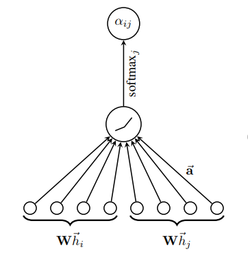
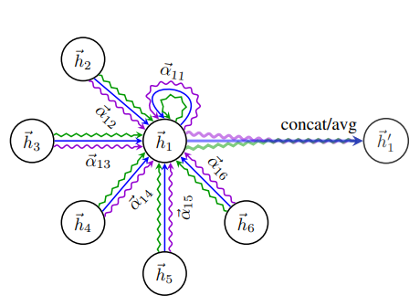

# 5. GAT

在之前介绍的GraphSAGE文章中，通过融合当前节点的邻居节点来获得这个节点的特征表示，从而将CGN扩展到了归纳学习的领域。在GraphSAGE中，各个邻居节点被等同的看待，然而在实际场景中，不同的邻居节点可能对核心节点起着不同的作用。这一部分要介绍的GAT（Graph Attention Network）就是通过自注意力机制self-attention来对邻居节点进行聚合，实现了对不同邻居的权值自适应匹配，从而提高了模型的准确率。GAT在归纳学习和转导学习的任务中均取得了不错的效果。

贡献点：

- 引入masked self-attentional layers 来改进前面图卷积graph convolution的缺点

- 对不同的相邻节点分配相应的权重，既不需要矩阵运算，也不需要事先知道图结构

- 四个数据集上达到state of the art的准确率Cora、Citeseer、Pubmed、protein interaction

GraphAttentionNetwork（GAT）提出了用注意力机制对邻近节点特征加权求和。邻近节点特征的权重完全取决于节点特征，独立于图结构。GAT和GCN的核心区别在于如何收集并累和距离为1的邻居节点。图注意力模型GAT用注意力替代了GCN中固定标准化操作。本质上，GAT只是将原来GCN的标准化函数替换为使用注意力权重的邻居节点特征聚合函数。

##  5.1 图注意力层的输入与输出

- 图注意力层的输入是：一个节点特征向量集

$$
h=\{\vec{h}_1,\vec{h}_2,...,\vec{h}_N\},\vec{h}_i\in R^F
$$

其中N为节点个数，F为节点特征个数。矩阵h的大小为N×F，代表了所有节点的特征，而R只代表某一节点的特征，大小为F×1

- 每一层的输出是：一个新的节点特征向量集：

$$
h^{`}=\{\vec{h^{`}}_1,\vec{h^{`}}_2,...,\vec{h^{`}}_N\},\vec{h^{`}}_i\in R^{F^{`}}
$$

其中$F^{`}$表示新的节点特征向量维度（可以不等于F）

GAT和GCN同样也是一个特征提取器，针对的是N个节点，按照其输入的节点特征预测输出新的节点特征。

## 5.2 特征提取与注意力机制

为了得到相应的输入与输出的转换，我们需要根据输入的特征至少进行一次线性变换得到输出的特征，所以我们需要对所有节点训练一个权重矩阵：$W\in R^{F^{'}×F}$，这个权重矩阵就是输入的F个特征与输出$F^{`}$个特征之间的关系

针对每一个节点实行self-attention的注意力机制，注意力系树为：
$$
e_{i,j}=\alpha(W\vec{h}_i,W\vec{h}_j)
$$
注意：$\alpha$不是一个常数或是矩阵，是一个函数

- 这个公式表示了节点j对节点i的重要性，而不是去考虑图结构的信息。
- h就是节点的特征向量
- 下标i，j表示第i个节点和第j个节点。

```
self-attention机制：其作用是能够更好地学习到全局特征之间的依赖关系，self-attention通过直接计算图结构中任意两个节点之间的关系，一步到位地获取图结构的全局几何特征。
self-attention利用了attention机制，分三个阶段进行计算：
(1) 引入不同的函数和计算机制，根据Query和某个Key，计算两者的相似性，最常见的方法包括：求两者的向量点积，求两者的向量Cosine相似度或通过再引入额外的神经网络来求值；
(2) 引入类似softmax的计算方式对第一阶段的得分进行数值转换，一方面可以进行归一化，将原始计算分值整理成所有元素权重之和为1的概率分布；另一方面也可以通过softmax的内在机制更加突出重要元素的权重；
(3)第二阶段的计算结果a即为value对应的权重系数，然后进行加权求和即可得到attention数值。
```

作者通过masked attention将这个注意力机制引入图结构中，masked attention的含义是：仅将注意力分散到节点i的邻居节点集$N_i$中，即$j\in N_i$（节点i也是$N_i$的一部分）。为了使得注意力系数更容易计算和便于比较，我们引入了$softmax$对所有的i的相邻节点j进行正则化：
$$
\alpha_{ij}=softmax_j(e_{ij})=\frac{\exp(e_{ij})}{\sum_{k\in N_i}\exp(e_{ik})}
$$
GAT使用注意力机制$\alpha$是一个单层的前馈神经网络，$\vec{a}\in R^{2F^{`}}$是神经网络中连接层与层之间的权重矩阵，在该前馈神将网络的输出层上还加入了LeakyReLu函数，这里小于0倾斜度为0.2

```
LeakyReLu函数：ReLu是将所有的负值都设为零，相反，LeakyReLu是给所有负值赋予一个非零斜率
```

整理到一起可得到**完整的注意力机制**如下：
$$
\alpha_{ij}=\frac{\exp(LeakReLu(\vec{a}^T[W\vec{h}_i||W\vec{h}_j]))}{\sum_{k\in N_i}\exp(LeakReLu(\vec{a}^T[W\vec{h}_i||W\vec{h}_k]))}
$$

- ||符号的意思是连接操作（concatenation operation）
- T表示转置

注意：$e_{ij}$和$\alpha_{ij}$都叫“注意力系数”，只不过$\alpha_{ij}$是在$e_{ij}$的基础上进行归一化后的。



## 5.3 输出特征

通过上述运算得到了正则化后的不同节点之间的注意力系数，可以用来预测每个节点的输出特征：
$$
\vec{h}^{`}_i=\sigma(\sum_{j\in N_i}\alpha_{ij}W\vec{h}_j)
$$

- W为与特征相乘的权重矩阵
- $\alpha$为前面计算得到的注意力互相关系数
- $\sigma$为非线性激活函数
- $j\in N_i$中遍历的j表示所有与i相邻的节点

- 这个公式表示就是：**该节点的输出特征与和它相邻的所有节点有关，是它们的线性和的非线性激活后得到的。**

## 5.4 multi-head attention

为了稳定self-attention的学习过程，作者发现扩展机制采用multi-head attention是有益的。具体而言，K个独立注意力机制公式，然后将它们的特征连接起来。但是，如果我们对最终的网络执行multi-head attention，则连接操作不合适，相反，我们采用K平均来替代连接操作，并延迟应用最终的非线性激活函数，得到最终的公式：
$$
\vec{h}_i^{`}=\sigma(\frac{1}{K}\sum_{k=1}^K\sum_{j\in N_i}\alpha^k_{ij}W^k\vec{h}_j)
$$

- 共K个注意力机制需要考虑，k表示K中第k个
- 第k个注意力机制为$\alpha^k$
- 第k个注意力机制下输入特征的线性变换权重矩阵表示为$W^k$

```
multi-head attention：这里multi-head attention其实就是多个self-attention结构的结合，每个head学到在不同表示空间中的特征，多个head学习到的attention侧重点不同，这样给模型更大的空间。
```



由节点$\vec{h}_1$在其领域上的multi-head attention（具有K=3个头）的图示。不同的箭头样式和颜色表示独立的注意力计算，来自每个头的聚合特征被连接或平均以获得$\vec{h}^{`}_1$。