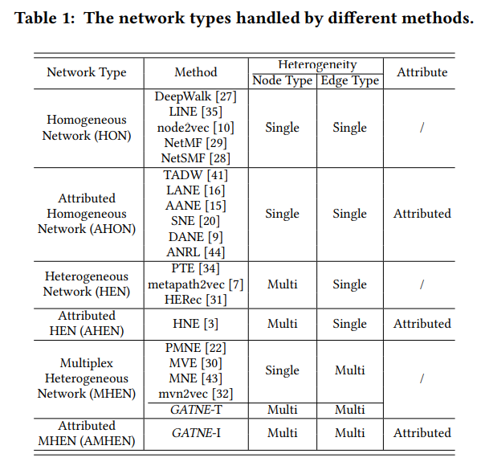
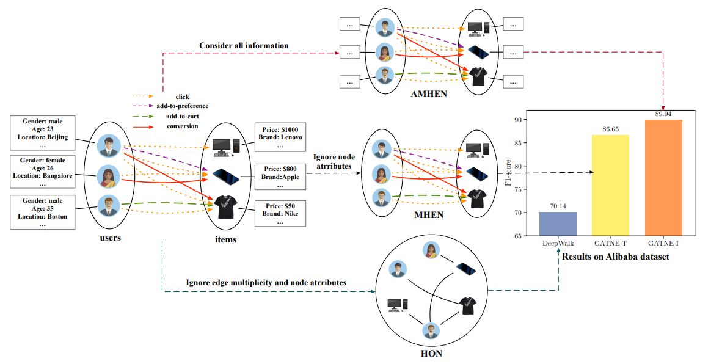
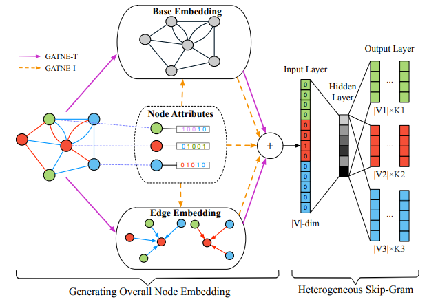

# 9. GATNE

## 9.1、背景

目前许多图嵌入应用大多都只是同构网络或者小尺度网络，而 真实世界往往大都是数以亿计的不同类型的节点和边，而且节点往往包含多种属性。即大规模多元异构属性网络。

针对大规模多元异构属性网络(attributed multiplex heterogeneous network)，即边和节点有多种类型，且节点有很多特征的网络，提出GATNE模型，学习每个节点在不同类型边下的嵌入表示，模型同时分为支持直推式的GATNE-T和归纳式的GATNE-I。
**Attributed Multiplex Heterogeneous Network的挑战：**

1. 多种类型的边：每个节点对可能有着多种关系。需要从不同的关系中学习特征再进而学习到统一的嵌入表示
2. 部分观察：真实的网络数据通常是部分被观测的，现有的大多数方法都聚焦于直推式学习，不能解决long-tail和冷启动问题
3. 大规模：真实的网络往往有亿级的节点和边，需要设计模型处理大规模数据

**文章贡献：**

1. 定义了多重异构特征网络嵌入
2. 同时支持直推式和归纳式学习嵌入，并提供了理论证明
3. 模型高效，适合处理大规模数据

## 9.2、算法原理

### 网络分类及建模

根据不同节点类型（单一节点/多种节点）、不同边类型（单一边/多种边）、节点性质（有性质/无性质），可以分为以下六种网络模型，不同网络有不同的建模方法。



而本文中关注的Attributed Multiplex Heterogeneous Network(AMHEN)：

1. Attributed：考虑节点性质，如性别、年龄、购买力等
2. Multiplex：多重边，节点之间可能有多种关系，比如两用户之间可能同为朋友、同学以及交易关系等；用户和Item之间可以同时有浏览、点击、添加到购物车等
3. Heterogeneous：异构，节点和边有多种类型，即节点类型+边类型$\gt 2$



如上图中间，三种建模方法AMHEN(Attributed Multiplex Heterogeneous Network)、MHEN（Multiplex Heterogeneous Network）和HON（Homogeneous Network）。从右图结果中可以看出AMHEN（考虑多种类型、节点性质的异构图网络）优于MHEN（不考虑节点性质的异构网络）优于HON同构网络



本文提出的General Attributed Multiplex Heterogeneous Network Embedding(GATNE)，希望每个节点在不同类型的边中有不同的表示

```
例如用户A在点击商品的场景下学习一种向量表示，在购买商品场景下学习另一种向量表示，而不同的场景之间并不完全独立，希望用base embedding来当做不同类型关系传递信息的桥梁，综合base embedding和每一类型边的edge embedding来进行建模。
```

模型结构如图所示，网络结构利用两部分向量Base Embedding和Edge Embedding表示，其中Base Embedding为共享向量，出现在每一种边类型中；Edge Embedding在每一种边类型中不同。GATNE-T仅利用了网络结构信息，GATNE-I同时利用了网络结构信息和节点性质。

### Transductive Model：GATNE-T

如上图所示，在GATNE-T中，每个节点在每种edge type下的embedding由两部分组成，分别是**Base** **embedding**和**Edge** **embedding**。

- base embedding：每个节点在每种edge type下共享
- edge embedding：通过相邻节点的edge embedding计算得到的

GATNE-T的核心思想就是聚合不同类型的邻居到当前节点，然后对每一种边类型的节点都生成不同的向量表示，模型整体可以分为如下4步：

1. 类似Graphsage对邻居聚合的思想，节点$v_i$对类别为$r$的第$k$阶邻居进行聚合，得到edge Embedding $u_{i,r}^{(k)};u_{i,r}^{(k)}=aggregator({u_{j,r}^{(k-1)},\forall v_i\in \mathcal{N}_{i,r}})$
   1. $\mathcal{N}_{i,r}$是节点$v_i$边类型为$r$的邻居，节点$v_i$类型为$r$的边对应的向量$u^{(0)}_{i,r}$随机初始化
   2. 聚合函数可以为：
      1. 均值聚合：$u^{(k)}_{i,r}=\delta{(\hat{W}^{(k)}mean(\{u_{j,r}^{(k-1)},\forall{v_j\in{\mathcal{N}_{i,r}}}\})})$
      2. 最大池化聚合：$u^{(k)}_{i,r}=max(\{\delta(\hat{W}^{(k)}_{pool}u^{(k-1)}_{j,r}+\hat{b}_{pool}^{(k)},\forall{v_j\in{\mathcal{N}_{i,r}}}\}))$
2. 把k阶邻居，不同类型的边节点，对应的edge embedding进行聚合，得到$U_i=(u_{i,1},u_{i,2},...,u_{i,m})$
3. 由于我们不知道每个节点在每种edge type下的表示之间的关系，不同的边影响不同，所以我们通过self-attention的机制来建模这种相互关系，并得到每种edge type下的表示对于各个edge type的权重：$a_{i,r}=softmax(w^T_rtanh(W_rU_i))^T$（其中，$w_r\in{R^{da}},W_r\in{R^{da\times{s}}}$为要学习的参数）
4. 综合base embedding和edge embedding得到最终节点$v_i$边类型$r$的节点向量表示：$v_{i,r}=b_i+\alpha_rM_r^TU_i\mathcal{a}_{i,r}$（其中$b_i$为节点i的base embedding，$\alpha_r$为超参数控制edge embedding的重要程度，$M_r\in{R^{s\times{d}}}$是学习的参数

然后将GATNE-T和MNE(Hongming Zhang, Liwei Qiu, Lingling Yi, and Yangqiu Song. 2018. Scalable Multiplex Network Embedding. In IJCAI’18. )。区别在于GATNE-T为不同类型的边分配了注意力。

### Inductive Model: GATNE-I

由于GATNE-T不能处理未见过的数据，进而提出了GATNE-I模型

```
由于实际问题中会遇见冷启动等问题，需要给没有在训练集中出现过的节点也求得embedding。而直推式模型不具备这种能力。所以引入节点的特征提出相应的归纳式学习模型。
```

对比GATNE-T模型$v_{i,r}=b_i+\alpha_rM^T_rU_ia_{i,r}$，GATNE-I的改进主要在：

1. **base embedding**：GATNE-T中的base embedding$b_i$是随机初始化的，而在GATNE-I中考虑利用节点特征生成$b_i$，即$b_i=h_z(x_i)$，其中$h_z$为节点类型为z的转化函数（比如线性变化或者神经网络、多层感知机）
2. **初始edge embedding**：GATNE-T中的初始edge embedding同样是随机初始化的，在GATNE-I中也为节点特征的转换函数，即$u^{(0)}_{i,r}=g_{z,r}(x_i)$（$g_{z,r}$表示节点类型为z边类型为r)
3. 最终节点边类型为r的embedding$v_{i,r}$：添加节点特征，$v_{i,r}=h_z(x_i)+\alpha_rM_r^TU_ia_{i,r}+\beta_rD_r^Tx_i$（其中$\beta_r$为系数，$D_z$是类型为z的节点$v_i$的特征转化矩阵，均为要学习的参数）

总结：

归纳式模型之所以可以处理训练中未出现过的节点，是因为其并不是为每一个节点直接训练$b_i$和$u^{(0)}_{i,r}$，而是训练节点特征$x_i$的转换函数：$h_z$和$g_{z,r}$，即为新加入的节点生成嵌入表示时，**用到了节点的属性特征信息$x_i$，为了生成边嵌入，聚合的也是邻居节点的属性特征信息**

## 9.3、模型优化

利用基于元路径的随机游走方法和Skip-Gram来学习模型参数。

给定第$r$种边关系的网络$G_r=(V,E_r)$，和长度为$l$的元路径$\tau:v_1\to v_2\to...v_t....v_l$，则在第t步转移概率为：$p(v_j|v_i,\tau)\left\{ \begin{array}{l}
	\frac{1}{|\mathcal{N}_{i,r}\cap v_{t+1}|}\quad (v_i,v_j)\in \xi_r,v_j\in V_{t+1}\\
	0\quad (v_i,v_j)\in \xi_r,v_j\notin V_{t+1}\\
	0\quad (v_i,v_j)\notin \xi_r\\
\end{array} \right.$

即只有当边类型属于类型$r$时，且节点类型符合路径中的节点类型才能被采样


