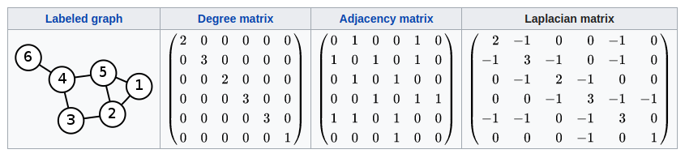
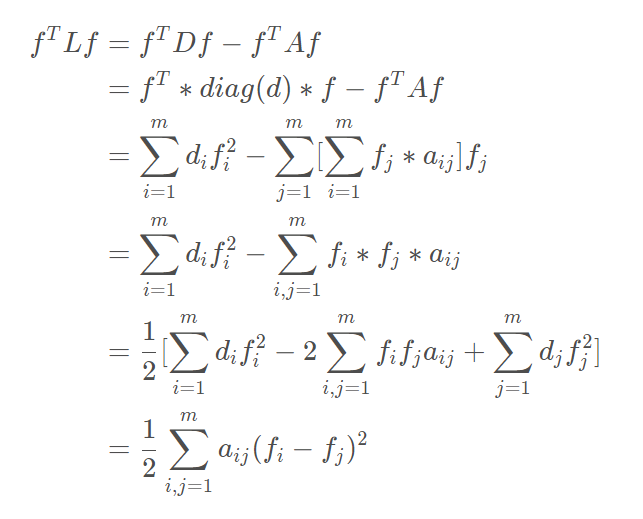
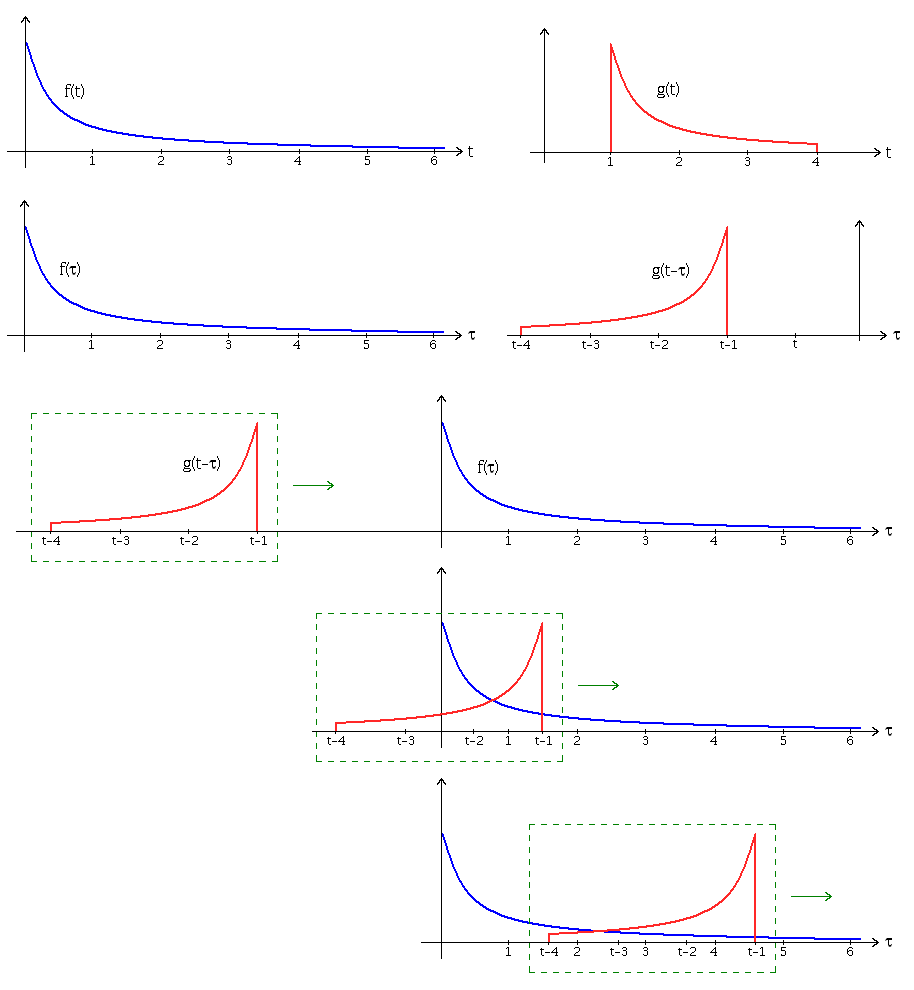
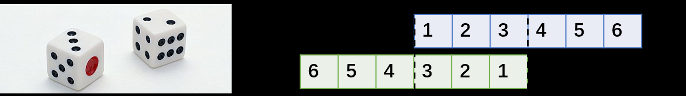
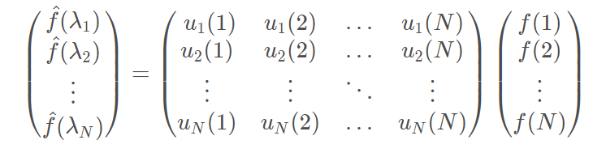
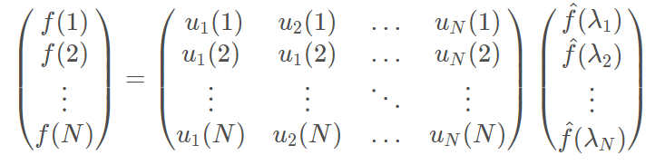

# 3.GCN

简单来说，Graph Embedding技术一般通过特定的策略对图中的顶点进行游走采样进而学习到图中的顶点的相似性，可以看做是一种将图的拓扑结构进行向量表示的方法。

然而现实世界中，图中的顶点还包含若干的属性信息，如社交网络中的用户画像信息，引文网络中的文本信息等，对于这类信息，基于GraphEmbedding的方法通常是将属性特征拼接到顶点向量中提供给后续任务使用。

本文介绍的GCN则可以直接通过对图的拓扑结构和顶点的属性信息进行学习来得到任务结果。

**GCN的本质目的就是用来提取拓扑图的空间特征**。 而图卷积神经网络主要有两类，

- 一类是基于**空间域或顶点域vertex domain(spatial domain)**的

- 一类则是基于**频域或谱域spectral domain**的

通俗点解释，空域可以类比到直接在图片的像素点上进行卷积，而频域可以类比到对图片进行傅里叶变换后，再进行卷积。

## 3.1 图卷积

普通卷积神经网络研究的对象是具备Euclidean domains的数据，Euclidean domains data数据最显著的特征是他们具有规则的空间结构，如图片是规则的正方形，语音是规则的一维序列等，这些特征都可以用一维或二维的矩阵来表示，卷积神经网络处理起来比较高效。

CNN的【平移不变性】在【非矩阵结构】数据上不适用

- **平移不变性（translation invariance）**：比较好理解，在用基础的分类结构比如ResNet、Inception给一只猫分类时，无论猫怎么扭曲、平移，最终识别出来的都是猫，**输入怎么变形输出都不变**这就是平移不变性，网络的层次越深这个特性会越明显。
- **平移可变性（translation variance）**：针对目标检测的，比如一只猫从图片左侧移到了右侧，检测出的猫的坐标会发生变化就称为平移可变性。当卷积网络变深后最后一层卷积输出的feature map变小，物体在输入上的小偏移，经过N多层pooling后在最后的小feature map上会感知不到，这就是为什么R-FCN原文会说网络变深平移可变性变差。

**离散卷积本质就是一种加权求和**。CNN中的卷积就是一种离散卷积，本质上就是利用一个共享参数的过滤器（kernel），通过**计算中心像素点以及相邻像素点的加权和来构成feature map实现空间特征的提取**，当然**加权系数就是卷积核的权重系数(W)**。

卷积核的系数通过随机化初值，然后根据误差函数通过反向传播梯度下降进行迭代优化。这是一个关键点，卷积核的参数通过优化求出才能实现特征提取的作用，GCN的理论很大一部分工作就是为了引入可以优化的卷积参数。

生活中很多数据不具备规则的空间结构，称为Non Euclidean data，如，推荐系统、电子交易、分子结构等抽象出来的图谱。这些图谱中的每个节点连接不尽相同，有的节点有三个连接，有的节点只有一个连接，是不规则的结构。对于这些不规则的数据对象，普通卷积网络的效果不尽人意。CNN卷积操作配合pooling等在结构规则的图像等数据上效果显著，但是如果作者考虑非欧氏空间比如图(即graph，流形也是典型的非欧结构，这里作者只考虑图)，就难以选取固定的卷积核来适应整个图的不规则性，如邻居节点数量的不确定和节点顺序的不确定。

比如：社交网络非常适合用图数据来表达，如社交网络中节点以及节点与节点之间的关系，用户A（有ID信息等）、用户B、帖子都是节点，用户与用户之间的关系是关注，用户与帖子之间的关系可能是发布或者转发。通过这样一个图谱，可以分析用户对什么人、什么事感兴趣，进一步实现推荐机制。

总结一下，图数据中的空间特征具有以下特点：

1. **节点特征**：每个节点有自己的特征；（体现在点上）
2. **结构特征**：图数据中的每个节点具有结构特征，即节点与节点存在一定的联系。（体现在边上）

总地来说，图数据既要考虑**节点信息**，也要考虑**结构信息**，图卷积神经网络就可以自动化地既**学习节点特征**，又能**学习节点与节点之间的关联信息**。

综上所述，GCN是要为除CV、NLP之外的任务提供一种处理、研究的模型。
**图卷积的核心思想是利用『边的信息』对『节点信息』进行『聚合』从而生成新的『节点表示』。**

## 3.2 拉普拉是矩阵

拉普拉斯矩阵(Laplacian matrix) 也叫做导纳矩阵、**基尔霍夫矩阵**或**离散拉普拉斯算子**，主要应用在图论中，作为一个图的矩阵表示。对于图 G=(V,E)，其Laplacian 矩阵的定义为 L=D-A，其中 L 是Laplacian 矩阵， D=diag(d)是顶点的度矩阵（对角矩阵）,d=rowSum(A)，对角线上元素依次为各个顶点的度， A 是图的邻接矩阵。

Graph Fourier Transformation及Graph Convolution的定义都用到图的拉普拉斯矩阵。

**频域卷积的前提条件是图必须是无向图**，只考虑无向图，那么L就是对称矩阵。

- 普通形式下的拉普拉斯矩阵

$$
L=D-A
$$

L中的元素给定为：
$$
L_{i,j}=\left\{ \begin{array}{l}
	diag(v_i)\quad i=j\\
	-1\quad i\neq j\ and\ v_i\ is\ adjacent\ to\ v_j\\
	0\quad otherwise\\
\end{array} \right.
$$
其中diag(vi) 表示顶点 i 的度。

- 对称归一化的拉普拉斯矩阵（Symmetric normalized Laplacian）

$$
L^{sys}=D^{-1/2}LD^{-1/2}=I-D^{-1/2}AD^{-1/2}
$$

矩阵定义为
$$
L_{i,j}^{sys}=\left\{ \begin{array}{l}
	1\quad i=j\\
	-\frac{1}{\sqrt{diag(v_i)diag(v_j)}}\quad i\neq j\ and\ v_i\ is\ adjacent\ to\ v_j\\
	0\quad otherwise\\
\end{array} \right.
$$
很多GCN的论文中应用的是这种拉普拉斯矩阵

- 随机游走归一化拉普拉斯矩阵（Random walk normalized Laplacian）

$$
L^{rw}=D^{-1}L=I-D^{-1}A
$$

矩阵元素定义
$$
L_{i,j}^{rw}=\left\{ \begin{array}{l}
	1\quad i=j\\
	-\frac{1}{diag(v_i)}\quad i\neq j\ and\ v_i\ is\ adjacent\ to\ v_j\\
	0\quad otherwise\\
\end{array} \right.
$$

- 泛化的拉普拉斯（Generalized Laplacian)

泛化的拉普拉斯(用得少)定义为:
$$
\left\{ \begin{array}{l}
	Q_{i,j}<0\quad i\neq j\ and\ diag(v_i)\neq 0\\
	Q_{i,j}=0\quad i\neq j\ and\ v_i\ is\ adjacent\ to\ v_j\\
	anynumber\quad otherwise\\
\end{array} \right.
$$
标准归一化的拉普拉斯矩阵还是对称的，并且符合前面的公式定义。

Graph Convolution与Diffusion相似之处，当然从Random walk normalized Laplacian就能看出了两者确有相似之处

### 拉普拉斯矩阵的性质

- 拉普拉斯矩阵是个半正定矩阵（最小特征值大于等于0）
- **特征值中0出现的次数就是图连通区域的个数**
- 最小特征值是0，因为拉普拉斯矩阵（普通形式：L=D-A）每一行的和均为0，**并且最小特征值对应的特征向量是每个全为1的向量**
- 最小非零特征值是图的代数连通度。

拉普拉斯矩阵的半正定性证明,如下：
要证明拉普拉斯矩阵是半正定的，只需要证明其二次型$f^TLf\ge0$

所以，对于任意一个属于实向量$f\in R^m$(f为m*1的实数向量)，都有此公式成立：$f^TLf=\frac{1}{2}\sum^m_{i,j=1}(f_i-f_j)^2$

### GCN用拉普拉斯矩阵的理由

- 拉普拉斯矩阵是对称矩阵，可以进行特征分解（谱分解）
- 由于卷积在傅里叶域的计算相对简单，为了在graph上做傅里叶变换，需要找到graph的连续的正交基对应于傅里叶变换的基，因此要使用拉普拉斯矩阵的特征向量。

### 拉普拉斯矩阵的谱分解（特征分解）

特征分解（Eigendecomposition），又称**谱分解**（Spectral decomposition）是将矩阵分解为由其特征值和特征向量表示的矩阵之积的方法。**只有对可对角化矩阵或有n个线性无关的特征向量的矩阵才可以施以特征分解。**

不是所有的矩阵都可以特征分解，其充要条件为**n阶方阵存在n个线性无关的特征向量**。

但是拉普拉斯矩阵是半正定矩阵（半正定矩阵本身就是对称矩阵），有如下三个性质：

- 对称矩阵一定n个线性无关的特征向量
- 半正定矩阵的特征值一定非负
- 对称矩阵的不同特征值对应的特征向量相互正交，这些正交的特征向量构成的矩阵为正交矩阵

由上拉普拉斯矩阵对称知一定可以谱分解，且分解后有特殊的形式。

对于拉普拉斯矩阵其谱分解为：
$$
L=U\Lambda U^{-1}=U\left[ \begin{matrix}
	\lambda _{1}& &	\\
	&		...&		\\
	&		&		\lambda _{n}\\
\end{matrix} \right] U^{-1}
$$
其中$U=(\vec{u_1},\vec{u_2},...,\vec{u_n})$，是列向量为单位特征向量的矩阵，也就是说$\vec{u_i}$是列向量，$\Lambda$是由n个特征值构成的对角矩阵。

由于U是正交矩阵，即$UU^T=E$，所以特征分解又可以写成：
$$
L=U\Lambda U^{-1}=U\Lambda U^T
$$
注意，特征分解最右边的是特征矩阵的逆，只是拉普拉斯矩阵是对称矩阵才可以写成特征矩阵的转置.

### 拉普拉斯算子

定义：拉普拉斯算子是n维欧几里德空间中的一个二阶微分算子，定义为梯度$(\nabla f)$的散度$(\nabla \cdot f,即\nabla f\cdot f)$。因此如果f是二阶可微的实函数，则f的拉普拉斯算子$\bigtriangleup   $定义为：
$$
\bigtriangleup f=\nabla^2f=\nabla \cdot\nabla f
$$
f的拉普拉斯算子也是笛卡尔坐标系xi中的所有非混合二阶偏导数：
$$
\bigtriangleup f=\sum^n_{i=1}\frac{\partial^2f}{\partial x_i^2}
$$
函数f的拉普拉斯算子也是该函数的海塞矩阵(是一个多元函数的二阶偏导数构成的方阵)的迹:
$$
\bigtriangleup f=\tr(H(f))
$$
拉普拉斯算子(Laplacian operator) 的物理意义是空间二阶导，准确定义是：标量梯度场中的散度，一般可用于描述物理量的流入流出。比如说在二维空间中的温度传播规律，一般可以用拉普拉斯算子来描述。**拉普拉斯矩阵也叫做离散的拉普拉斯算子**。

## 3.3 卷积

### 连续形式的一维卷积

在泛函分析中，卷积是通过两个函数f(x)和g(x)生成第三个函数的一种算子，它代表的意义是：**两个函数中的一个(取g(x)，可以任意取)函数，把g(x)经过翻转平移,然后与f(x)的相乘，得到的一个新的函数，对这个函数积分，也就是对这个新的函数求它所围成的曲边梯形的面积。**

设f(t),g(t)是两个可积函数，f(t)与g(t)的卷积记为$f(t)*g(t)$，它是其中一个函数翻转并平移后与另一个函数乘积的积分，是一个自变量是平移量的函数。也就是：
$$
f(t)*g(t)=\int^{+\infty}_{-\infty}f(\tau)g(t-\tau)d\tau=\int^{+\infty}_{-\infty}f(t-\tau)g(\tau)d\tau
$$

### 离散形式的一维卷积

对于定义在整数$ \mathbb{Z}$上的函数f,g,卷积定义为
$$
(f*g)(t)=\sum^{\infty}_{\tau=-\infty}f(\tau)g(t-\tau)
$$

### 例子

光看数学定义可能会觉得非常抽象，下面举一个掷骰子的问题，该实例参考了知乎问题"如何通俗易懂地解释卷积"的回答。

想象现在有两个骰子，两个骰子分别是f跟g，f(1)表示骰子f向上一面为数字1的概率。同时抛掷这两个骰子1次，它们正面朝上数字和为4的概率是多少呢？相信读者很快就能想出它包含了三种情况，分别是：

- f向上为1，g向上为3；
- f向上为2，g向上为2；
- f向上为3，g向上为1；

最后这三种情况出现的概率和即问题的答案，如果写成公式，就是$\sum^3_{\tau=1}f(\tau)g(4-\tau)$。

如果稍微扩展一点，比如说认为 f(0) 或者 g(0)等是可以取到的，只是它们的值为0而已。那么该公式可以写成$\sum_{\tau=-\infty}^{\infty}f(\tau)g(4-\tau)$。仔细观察，这其实就是卷积(f∗g)(4)。如果将它写成内积的形式，卷积其实就是
$$
[f(-\infty),...f(1),...,f(\infty)]\cdot[g(\infty),...,g(3),...,g(-\infty)]
$$
**所谓卷积，其实就是把一个函数卷(翻)过来，然后与另一个函数求内积**。

对应到不同方面，卷积可以有不同的解释：g 既可以看作我们在深度学习里常说的核(Kernel)，也可以对应到信号处理中的滤波器(Filter)。而 f 可以是我们所说的机器学习中的特征(Feature)，也可以是信号处理中的信号(Signal)。f和g的卷积 (f∗g)就可以看作是对f的加权求和。下面两个动图就分别对应信号处理与深度学习中卷积操作的过程。

## 3.4 傅里叶变换

### 连续形式的傅立叶变换

任意一个周期函数可以由若干个正交函数（由sin，cos构成）的线性组合构成，傅里叶级数的形式如下：
$$
f(x)=a_0+\sum_{n=1}^{\infty}(a_ncos(\frac{2\pi n}{T}x)+b_nsin(\frac{2\pi n}{T}x)),a_0\in R
$$
利用欧拉公式$e^{ix}=\cos x+i\sin x$（这里指复数中的i）(由省略余项的麦克劳林公式推导），cos，sin可表示成
$$
\cos x=\frac{e^{ix}+e^{-ix}}{2},\sin x=\frac{e^{ix}-e^{-ix}}{2}
$$
所以对于任意周期函数可以以$e^{iwt}$为基函数用傅里叶级数的指数形式表示。即，对于一个周期函数$f(x)$以傅里叶级数的指数表达为：
$$
f(x)=\sum_{n=-\infty}^{\infty}c_n\cdot e^{i\frac{2\pi nx}{T}}
$$
但是对于非周期函数，并不能用傅里叶级数的形式表示。但是还是用某个周期函数$f_T(x)$当$T\to \infty$来逼近，即$\lim_{T\to \infty}f_T(x)=f(x)$，用积分的形式表示：
$$
f(x)=\int^{\infty}_{-\infty}[\int^{+\infty}_{-\infty}f(x)e^{-iwx}dx]e^{iwx}dw=\int_{-\infty}^{\infty}F(w)e^{iwx}dx
$$
其中，$F(w)$就是$f(w)$的连续形式的傅里叶变换：
$$
F(w)=F(f(x))=\int^{+\infty}_{-\infty}f(x)e^{-iwx}dx
$$
可以看出，f（x）和F（w）可以通过指定的积分运算相互表达。

当然，也可以利用欧拉公式通过cos和sin函数表示为$F(u)$
$$
F(u)=\int^{+\infty}_{-\infty}f(x)[\cos(2\pi xu)-i\sin(2\pi xu)]dx
$$
所以，对函数f(x)的傅里叶变换F和傅里叶逆变换$F^{-1}$记作：
$$
F(w)=F[f(x)],f(x)=F^{-1}[F(w)]
$$

- F(w)叫做f(x)的象函数或傅里叶变换，即通过傅里叶变换后关于频率的函数，函数图像就是频谱，w就是f对应的频率中的频率
- f（x）叫做F（w）的原象函数

其实可以发现这个对信号f(x)的傅里叶变换F(w)形式上是f(x)与基函数$e^{-iwx}$的积分，本质上将函数f(x)映射到了以$e^{-iwx}$为基的空间中

### 周期性离散傅里叶变换（Discrete Fourier Transform, DFT）

傅里叶变换有连续时间非周期傅里叶变换，连续时间周期性傅里叶变换，离散时间非周期傅里叶变换和离散时间周期性傅里叶变换，鉴于计算机主要处理离散周期性信号，本文主要介绍周期性离散时间傅里叶变换（DFT）。信号$x_n$的傅里叶变换$X_k$为
$$
X_k=\sum^{N-1}_{n=0}x_ne^{-i\frac{2\pi}{N}kn}
$$
信号$x_n$用其傅里叶变换$X_k$表示为：
$$
x_n=\sum^{N-1}_{n=0}X_ke^{i\frac{2\pi}{N}kn}
$$
其中：

- N表示傅里叶变换的点数
- k表示傅里叶变换的第k个频谱

## 3.5 Graph上的傅里叶变换及卷积

**把传统的傅里叶变换以及卷积迁移到Graph上来，核心工作其实就是把拉普拉斯算子的特征函数$e^{-iwt}$变为Graph对应的拉普拉是矩阵的特征值**

傅立叶变换与拉普拉斯矩阵的关系：**传统傅立叶变换的基，就是拉普拉斯矩阵的一组特征向量。**

### 图上的傅里叶变换

前面讲到可以用一组正交函数cos和sin(或$e^{iwt}$)表示任意函数，且傅里叶变换是连续形式的，在处理Graph时，用到的是傅里叶变换的离散形式。由于拉普拉斯矩阵进行谱分解以后，可以得到n个线性无关的特征向量，构成空间中的一组正交基，因此归一化拉普拉斯矩阵算子的特征向量构成了图傅里叶变换的基。图傅里叶变换将输入图的信号投影到了正交空间，相当于把图上定义的任意向量，表示成了拉普拉斯矩阵特征向量的线性组合。
离散积分就是一种内积形式，由此可以定义Graph上的傅里叶变换（实数域）:
$$
F(\lambda_l)=\hat{f(\lambda_l)}=\sum^N_{i=1}f(i)u_l(i)
$$

- f是Graph上的N维向量，可以表示某个点的特征向量，f（i）表示第i个特征
- $u_l(i)$表示第l个特征向量的第i个分量
- f的Graph傅里叶变换就是与$\lambda_l$对应的特征向量$u_l$进行内积运算
- $\lambda$就对应w

### 图的傅立叶变换——图的傅立叶变换的矩阵形式

利用矩阵乘法将Graph上的傅里叶变换推广到矩阵形式：

即f在Graph上傅里叶变换的矩阵形式为：
$$
\hat{f(x)}=U^Tf(a)
$$

### 图的傅立叶逆变换——图的傅立叶逆变换的矩阵形式

类似地，传统的傅里叶变换是对频率w求积分：
$$
F^{-1}[F(w)]=\frac{1}{2\Pi}\int F(w)e^{iwt}dw
$$
迁移到Graph上变为对特征值$\lambda_l$求和：
$$
f(i)=\sum_{l=1}^N\hat{f(\lambda_l)u_l(i)}
$$
利用矩阵乘法将Graph上的傅里叶逆变换推广到矩阵形式：

即 f 在Graph上傅里叶逆变换的矩阵形式为:
$$
f=U\hat{f}
$$

### 图上的傅里叶变换推广到图卷积

在上面的基础上，利用卷积定理类比来将卷积运算，推广到Graph上。

卷积定理：**函数卷积的傅里叶变换是函数傅立叶变换的乘积**，即对于函数f与g两者的卷积是其函数傅立叶变换乘积的逆变换（中间的桥梁就是傅立叶变换与反傅立叶变换)
$$
f*g=F^{-1}(F(f)\cdot F(g))=F^{-1}(\hat{f}\cdot \hat{g})
$$
所以，对图上f和卷积核g的卷积可以表示为：
$$
(f*g)_G=U((U^Tg)\cdot (U^Tf))
$$
如果把$U^Tg$整体看作学习的卷积核，这里我们把它写作$g_{\theta}$最终图上的卷积公式即是：
$$
(f*g)_G=Ug_{\theta}\cdot U^Tf
$$
有的地方，还把$g_{\theta}=U^Tg$也成对角矩阵的形式，即定义一个滤波$g_{\theta}=diag(U^Tg)$，则：
$$
f*g_{\theta}=Ug_{\theta}U^Tf=U
\left( \begin{matrix}
	\hat{g(\lambda_1)}& &	\\
	&		...&		\\
	&		&		\hat{g(\lambda _{n})}\\
\end{matrix} \right)U^Tf
$$
