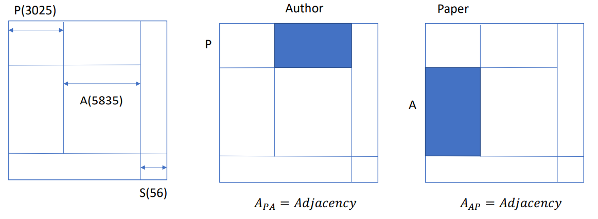
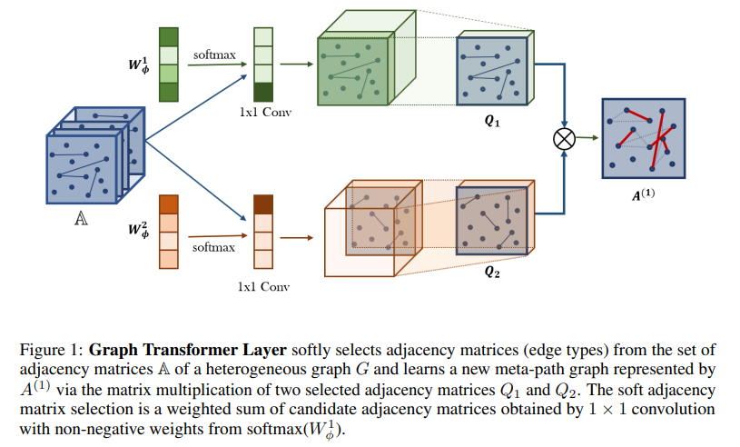

# 7. GTN

对于HAN表示异构图的Attention Network，通过手动设置`Meta-path`，然后聚合不同`Meta-path`下的节点attention，学到节点最终的表示。但是这个方法是手动选择Meta-path的，因此可能无法捕获每个问题的所有有意义的关系。同样，元路径的选择也会显著影响性能。

而Graph Transformer Networks是自动聚合`Meta-path`，同时以端到端的学习方式转换图上的节点表示形式。

## 7.1 概念

- $\iota^v$：节点的类型
- $\iota^e$：边的类型
- ACM数据集包含：Paper(3025)，Author(5835)，Subject(56)个类型，$\iota^v=3$，$\iota^e=\{PA,AP,PS,SP\}$，需要注意的是Author和Subject之间没有边的连接， 所以没有AS和SA的关系。
- $\{A_k\}^K_k=1,K=|\iota^e|$：邻接矩阵，例如Paper与Author的邻接矩阵的大小是3025 × 5835，而Paper与Subject的邻接矩阵的大小是3025 × 56，因此这两个邻接矩阵的shape大小不同。为了把shape统一到一起，需要将节点组合在一起，形成统一的一个邻接矩阵。如下图所示蓝色的部分就是PA的邻接矩阵，其余的地方数据为0，表示没有边的连接

特征矩阵： 每个Paper都有自己的特征，例如Paper1 = [1,0,0,0,1,1,0,....,0,0],Paper2=[1,1,0,1,0,1,0,.....,0,0]，而Author的特征是将对应的Paper特征拼在一起，例如Author1 = [Paper1, Paper2]=[1,1,0,1,0,1,0,....,0,0]，同理Subject也是将对应的Paper拼在一起，例如Subject1 = [Paper1, Paper3] = [1,1,0,1,1,1,0...,0,0]。需要注意的是，这里并不一定是要拼接在一起，可以做均值Pooling、或者max pooling、或者求和，可以根据自己的任务来选择。

## 7.2 模型

我们的图变换网络的目标是生成新的图结构，同时在学习到的图上学习节点表示。与大多数假设图是给定的CNNs不同的是，GTNS使用多个候选邻接矩阵寻找新的图结构，以执行更有效的图卷积，并学习更强大的节点表示。学习新的图结构涉及识别有用的元路径，它们是与异质边和多跳连接的路径。

### 元路径的生成

以前的工作需要手动定义元路径，并在元路径图上执行图神经网络。相反，我们的图转换网络(GTNs)学习给定数据和任务的元路径，并在所学习的元路径图上操作图卷积。这使我们有机会找到更有用的元路径，并使用多个元路径图生成几乎不同的图卷积。图1中图转换(GT)层中的新的元路径图生成有两个部分。首先，GT层从候选邻接矩阵A中柔和地选择两个图结构Q1和Q2。第二，它通过两个关系的组成来学习新的图结构(即两个邻接矩阵的矩阵乘法，Q1Q2)。
具体来说，

- 图1即表示GT(Graph Transformer) Layer，它先从tensor A \mathbb{A}A(每一片就是一种edge type)中用权重选择adjacency matrices(即edge type)。权重选择的方式也可以理解成卷积，卷积后的两个matrices分别是两个图结构，表示为$Q_1$和$Q_2$
- 选择matrices的两个卷积核是用softmax计算得出的(比如图中例子，一个卷积核说取最前面的matrices，一个卷积核说取最后面那个matrices)，但实际上是带有权重分配的。
- 然后再将两个matrices组成新的图结构(即两个邻接矩阵的矩阵乘法，$Q_1\cdot Q_1$

#### 数学表示

