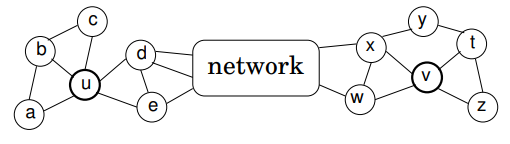
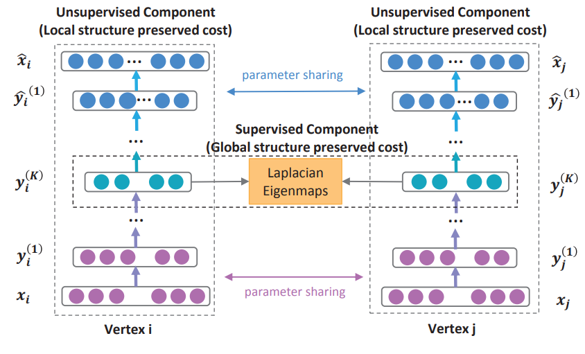

# 2. Graph Embedding

我们都知道在数据结构中，图是一种基础且常用的结构。现实世界中许多场景可以抽象为一种图结构，如社交网络，交通网络，电商网站中用户与物品的关系等。

目前提到图算法一般指：

1. 经典数据结构与算法层面的：最小生成树(Prim,Kruskal,…)，最短路(Dijkstra,Floyed,…)，拓扑排序，关键路径等
2. 概率图模型，涉及图的表示，推断和学习，详细可以参考Koller的书或者公开课
3. 图神经网络，主要包括Graph Embedding(基于随机游走)和Graph CNN(基于邻居汇聚)两部分。

这里先看下Graph Embedding的相关内容。

Graph Embedding技术将图中的节点以低维稠密向量的形式进行表达，要求在原始图中相似(不同的方法对相似的定义不同)的节点其在低维表达空间也接近。得到的表达向量可以用来进行下游任务，如节点分类，链接预测，可视化或重构原始图等。

## 2.1 DeepWalk

```
DeepWalk是KDD 2014的工作，但却是我们了解Graph Embedding无法绕过的一个方法。
我们都知道在NLP任务中，word2vec是一种常用的word embedding方法，
word2vec通过语料库中的句子序列来描述词与词的共现关系，进而学习到词语的向量表示。
```

### 随机游走

DeepWalk的思想类似word2vec，使用**图中节点与节点的共现关系**来学习节点的向量表示。那么关键的问题就是如何来描述节点与节点的共现关系，DeepWalk给出的方法是使用随机游走(RandomWalk)的方式在图中进行节点采样。RandomWalk是一种**可重复访问已访问节点的深度优先遍历**算法。给定当前访问起始节点，从其邻居中随机采样节点作为下一个访问节点，重复此过程，直到访问序列长度满足预设条件。


### 跳元模型

获取足够数量的节点访问序列后，使用skip-gram model (跳元模型）进行向量学习。


## 2.2 LINE

```
DeepWalk使用DFS随机游走在图中进行节点采样，使用word2vec在采样的序列学习图中节点的向量表示。
LINE也是一种基于邻域相似假设的方法，只不过与DeepWalk使用DFS构造邻域不同的是，LINE可以看作是一种使用BFS构造邻域的算法。
此外，LINE还可以应用在带权图中(DeepWalk仅能用于无权图)。
```

不同的graph embedding方法的一个主要区别是对**图中顶点之间的相似度的定义**不同，所以先看一下LINE对于相似度的定义。


### 一阶相似(first-order proximity)

1阶相似度用于描述图中成对顶点之间的局部相似度，形式化描述为若$u,u$之间存在边连接，则边权$w_{uv}$即为两个顶点的相似度，若不存在直接的边，则1阶相似度为0.

eg. 6和7之间存在直连边，且边权较大，则认为两者相似且1阶相似度较高，而5和6之间不存在直连边，则两者间1阶相似度为0。

### 二阶相似(second-order proximity)

仅有1阶相似度就够了吗？显然不够，如上图，虽然5和6之间不存在直连边，但是他们有很多相同的邻居顶点(1,2,3,4)，这其实也可以表明5和6是相似的，而2阶相似度就是用来描述这种关系的。
形式化定义为
$$
p_u=(w_{u,1},...,w_{u,|v|})
$$
其中，$p_u$表示顶点$u$与其他所有顶点之间的1阶相似度，则$u$与$v$的2阶相似度可以通过$p_u$和$p_v$的相似度表示。若$u$和$v$不存在相同的邻居节点，则2阶相似度为0.

### 优化目标

- 1st

对于每一条无向边(i,j)，定义顶点$v_i$和$v_j$之间的联合概率为：
$$
p_1(v_i,v_j)=\frac{1}{1+\exp(-\vec{u}_i^T\cdot \vec{u}_i)}
$$
$\vec{u}_i$为顶点$v_i$的低维向量表示（可以看作一个内积模型，计算两个item之间的匹配程度）

同时定义经验分布
$$
\hat{p_1}=\frac{w_{ij}}{W}\\W=\sum_{(i,j)\in E}{w_{ij}}
$$
优化目标为最小化:$O_1=d(\hat{p_1}(.,.),p_1(.,.))$，$d(.,.)$是两个分布的距离，常用的衡量两个概率分布差异的指标为KL散度，使用KL散度并忽略常数项后有
$$
O_1=-\sum_{(i,j)\in E}w_{ij}\log p_1(v_i,v_j)
$$
**1st order 相似度只能用于无向图当中。**

- 2nd

这里对于每个顶点维护两个embedding向量，一个是该顶点本身的表示向量，一个是该点作为其他顶点的上下文顶点时的表示向量。(跟word2vec类似)

对于有向边(i,j)，定义给定$v_j$条件下，生成上下文邻居顶点$v_j$的概率为
$$
p_2(v_i|v_j)=\frac{\exp(\vec{c_j}^T\cdot \vec{u_i})}{\sum^{|V|}_{k=1}\exp(\vec{c_k}^T\cdot \vec{u_i})}
$$
其中，$|V|$为上下文顶点的个数。

优化目标为$O=\sum_{i\in V}\lambda _id(\overset{\land}{p_2}(.|v_i),p_2(.|v_i))$，其中$\lambda _i$为控制节点重要性的因子，可以通过顶点的度数或则PageRank等方法估计得到

经验分布定义为$\overset{\land}{p_2}(v_j|v_i)=\frac{w_{ij}}{d_i}$,$w_{ij}$为边(i,j)的边权，$d_i$是顶点$v_i$的出度，对于带权图，$d_i=\sum_{k\in N(i)}W_{ik}$

同时使用KL散度并设$\lambda _i=d_i$，忽略常数项，有
$$
O_2=-\sum_{(i,i)\in E}w_{ij}\log p_2(v_i|v_j)
$$

### 优化技巧

- Negative sampling

由于计算2阶相似度时，softmax函数的分母计算需要遍历所有顶点，这是非常低效的，论文采用了负采样优化的技巧，目标函数变为：
$$
\log\delta(\vec{c_j}^T\cdot \vec{u_i})+\sum^K_{i=1}E_{v_n\sim P_n(v)}[-\log\delta(\vec{c_n}\cdot \vec{u_i})]
$$
其中，k为负边的个数，论文使用$P_n(v)\propto d^{3/4}_v$,$d_v$是顶点$v$的出度

- Edge Sampling

注意到我们的目标函数在log之前还有一个权重系数$w_{ij}$,在使用梯度下降方法优化参数时，$w_{ij}$会直接乘在梯度上。如果图中的边权方差很大，则很难选择一个合适的学习率。若使用较大的学习率那么对于较大的边权可能会引起梯度爆炸，较小的学习率对于较小的边权则会导致梯度过小。

对于上述问题，如果所有边权相同，那么选择一个合适的学习率会变得容易。这里采用了将带权边拆分为等权边的一种方法，假如一个权重为$w$的边，则拆分后为$w$个权重为1的边。这样可以解决学习率选择的问题，但是由于边数的增长，存储的需求也会增加。

另一种方法则是从原始的带权边中进行采样，每条边被采样的概率正比于原始图中边的权重，这样既解决了学习率的问题，又没有带来过多的存储开销。

这里的采样算法使用的是Alias算法，Alias是一种O(1)时间复杂度的离散事件抽样算法。

### 其他问题

对于新加入图的顶点$v_i$ ，若该顶点与图中顶点存在边相连，我们只需要固定模型的其他参数，优化如下两个目标之一即可：
$$
-\sum_{i\in N(i)}w_{ij}\log p_1(v_j,v_i)
$$
若不存在边相连，则需要利用一些side info，留到后续工作研究。

## 2.3 Node2vec

```
node2vec是一种综合考虑DFS邻域和BFS邻域的graph embedding方法。
简单来说，可以看作是deepwalk的一种扩展，可以看作是结合了DFS和BFS随机游走的deepwalk。
```


### 优化目标

设f(u)是将顶点u映射为embedding向量的映射函数，对于图中每个顶点u，定义$N_s(u)$为通过采样策略S采样出的顶点u的近邻顶点集合。

node2vec优化的目标是给定每个顶点条件下，令其近邻顶点出现的概率最大。
$$
\max_f \sum_{u\in V}\log P_r(N_s(U)|f(u))
$$
为了将上述最优化问题可解，文章提出两个假设：

- 条件独立性假设
  - 假设给定源顶点下，其近邻顶点出现的概率与近邻集合中其余顶点无关。
  - $P_r(N_s(U)|f(u))=\prod_{n_i\in N_s(u)}P_r(n_i|f(u))$
- 特征空间对称性假设
  - 一个顶点作为源顶点和作为近邻顶点的时候**共享同一套embedding向量**。(对比LINE中的2阶相似度，一个顶点作为源点和近邻点的时候是拥有不同的embedding向量的)
  - 在这个假设下，上诉的概率公式可表示为$P_r(n_i|f(u))=\frac{\exp{f(n_i)\cdot f(u)}}{\sum_{v\in V}\exp{f(v)\cdot f(v)}}$

根据以上两个假设条件，最终的目标函数表示为
$$
\max_f{\sum_{u\in V}[-\log{Z_u}+\sum_{n_i\in N_s(u)}f(n_i)\cdot f(u)]}
$$
由于归一化因子$Z_u=\sum_{n_i\in N_s(u)}\exp{(f(n_i)\cdot f(u))}$的计算代价太高，所以采用负采样计算优化

### 采用策略

node2vec依然采用随机游走的方式获取顶点的近邻序列，不同的是node2vec采用的是一种有偏的随机游走。

给定顶点v，访问下一个顶点x的概率为
$$
P(c_i=x|c_{i-1}=v)=\left\{ \begin{array}{l}
	\frac{\pi_{vx}}{Z}\quad if(v,x)\in E\\
	0\quad otherwise\\
\end{array} \right.
$$
$\pi_{vx}$是顶点v和顶点x之间的未归一化转移概率，Z是归一化常数。

node2vec引入两个超参数p和q来控制随机游走的策略，假设当前随机游走经过边(t,v)到达顶点v，设$\pi_{vx}=\alpha_{pq}(t,x)\cdot w_{vx}$，$w_{vx}$是顶点v和x之间的边权
$$
\alpha_{pq}(t,x)=\left\{ \begin{array}{l}
	\frac{1}{p}\quad if\quad d_{tx}=0\\
	\ 1\quad if\quad d_{tx}=1\\
	\frac{1}{q}\quad if\quad d_{tx}=2\\
\end{array} \right.
$$
$d_{tx}$为顶点t和顶点x之间的最短路径距离。

下面讨论参数p和q对游走策略的影响

- Return parameter,p
  - 参数p控制重复访问刚刚访问过的顶点的概率。
  - 注意到p仅作用于$d_{tx}=0$的情况，而$d_{tx}=0$表示顶点x就是访问当前顶点v之前访问过的顶点。
  - 若p较高，则访问刚刚访问过的顶点的概率会变低，反之变高。
- In-out papameter,q
  - q控制着游走是向外还是向内
  - 若q大于1，随机游走倾向于访问和t接近的顶点(偏向BFS)。
  - 若q小于1，随机游走倾向于访问远离t t*t*的顶点(偏向DFS)。

下面的图描述的是当从t访问到v时，决定下一个访问顶点时每个顶点对应的$\alpha$。


### 学习算法

采样完顶点序列后，剩下的步骤就和deepwalk一样了，用word2vec去学习顶点的embedding向量。
值得注意的是node2vecWalk中不再是随机抽取邻接点，而是按概率抽取，node2vec采用了Alias算法进行顶点采样。

Alias Method:时间复杂度O(1)的离散采样方法。


## 2.4 Struc2vuc

```
前面介绍过DeepWalk,LINE,Node2Vec,SDNE几个graph embedding方法。这些方法都是基于近邻相似的假设的。其中DeepWalk,Node2Vec通过随机游走在图中采样顶点序列来构造顶点的近邻集合。LINE显式的构造邻接点对和顶点的距离为1的近邻集合。SDNE使用邻接矩阵描述顶点的近邻结构。
事实上，在一些场景中，两个不是近邻的顶点也可能拥有很高的相似性，对于这类相似性，上述方法是无法捕捉到的。Struc2Vec就是针对这类场景提出的。Struc2Vec的论文发表在2017年的KDD会议中。
```

### 相似度定义

Struc2Vec是从空间结构相似性的角度定义顶点相似度的。

用下面的图简单解释下，如果在基于近邻相似的模型中，顶点u和顶点v是不相似的，第一他们不直接相连，第二他们不共享任何邻居顶点。

而在struc2vec的假设中，顶点u和顶点v是具有空间结构相似的。他们的度数分别为5和4，分别连接3个和2个三角形结构，通过2个顶点(d,e;x,w)和网络的其他部分相连。



直观来看，具有相同度数的顶点是结构相似的，若各自邻接顶点仍然具有相同度数，那么他们的相似度就更高。

### 顶点对距离定义

令$R_k(u)$表示到顶点u距离为k的顶点集合，则$R_1(u)$表示是u的直接相连邻近集合。

令$s(S)$表示顶点集合S的**有序度序列**。

通过比较两个顶点之间距离为k的环路上的有序度序列可以推出一种层次化衡量结构相似度的方法。

令$f_k(u,v)$表示顶点u和v之间距离为k（这里的距离k实际上是指距离小于等于k的节点集合）的环路上的结构距离(注意是距离，不是相似度)。
$$
f_k(u,v)=f_{k-1}(u,v)+g(s(R_k(u)),s(R_k(v))),k\ge 0 \quad and\quad |R_k(u)|,|R(v)|\gt 0
$$
其中$g(D_1,D_2)\ge 0$是衡量有序度序列$D_1$和$D_2$之间的距离函数，并且$f_{-1}=0$

下面就是如何定义有序度序列之间的比较函数了，由于$s(R_k(u))$和$s(R_k(v))$的长度不同，并且可能含有重复元素。所以文章采用了**Dynamic Time Warping(DTW)**来衡量两个有序度序列。

一句话，DTW可以用来衡量两个不同长度且含有重复元素的的序列的距离（距离的定义可以自己设置）。

基于DWT，定义元素之间的距离函数
$$
d(a,b)=\frac{\max(a,b)}{\min(a,b)}-1
$$

```
至于为什么使用这样的距离函数，这个距离函数实际上惩罚了当两个顶点的度数都比较小的时候两者的差异。
举例来说，a=1,b=2情况下，a=101，b=102情况下的距离差异为0.0099.这个特征正是我们想要的
```

### 构建层次带权图

根据上一节的距离定义，对于每一个k kk我们都可以计算出两个顶点之间的一个距离，现在要做的是通过上一节得到的顶点之间的有序度序列距离来构建一个层次化的带权图（用于后续的随机游走）。
我们定义在**某一层**$k$**中两个顶点**的边权为$w_k(u,v)=e^{-f_k(u,v)},k=0,...,k^*$

这样定义的边权都是小于1的，当且仅当距离为0的是时候，边权为1。

通过有向边将**属于不同层次的同一顶点**连接起来，具体来说，对每个顶点，都会和其对应的上层顶点还有下层顶点相连。边权定义为
$$
w(u_k,u_{k+1})=\log(\Gamma_k(u)+e),k=0,...,k^*-1\\w(u_k,u_{k-1})=1
$$
其中$\Gamma_k(u)$是第k层与u相连的边边权大于平均边权的边的数量
$$
\Gamma_k(u)=\sum_{v\in V}1(w_k(u,v)\gt\bar{w_k})
$$
$\bar{w_k}$就是第k层所有边权的平均值

### 采样获取顶点序列

使用有偏随机游走在构造出的图M中进行顶点序列采样。

每次采样时，首先决定是在当前层游走，还是切换到上下层的层游走。

- 若决定在当前层游走，设当前处于第k层，则从顶点u到顶点v的概率为：$p_k(u,v)=\frac{e^{-f_k(u,v)}}{Z_k(u)}$

其中$Z_k(u)=\sum_{v\in V,v\neq u}e^{-f_k(u,v)}$是第k层中关于顶点u的归一化因子。

通过在图M中进行随机游走，每次采样的顶点更倾向于选择与当前顶点结构相似的顶点。因此，采样生成的上下文顶点很可能是结构相似的顶点，这与顶点在图中的位置无关。

- 若决定切换不同的层，则以如下的概率选择k+1层或k-1层

$$
p_k(u_k,u_{k+1})=\frac{w(u_k,u_{k+1})}{w(u_k,u_{k+1})+w(u_k,u_{k-1})}\\p_k(u_k,u_{k-1})=1-p_k(u_k,u_{k+1})
$$

### 三个时空复杂度优化技巧

#### OPT1 有序度序列长度优化

前面提到过对于每个顶点在每一层都有一个有序度序列，而每一个度序列的空间复杂度为O(n)。

文章提出一种压缩表示方法，对于序列中出现的每一个度，计算该度在序列里出现的次数。压缩后的有序度序列存储的是**(度数，出现次数)**这样的二元组。

同时修改距离函数为：
$$
d(a,b)=(\frac{\max(a_0,b_0)}{\min(a_0,b_0)}-1)\max(a_1,b_1)
$$
$a_0,b_0$为度，$a_1,b_1$为出现次数。

#### OPT2 相似度计算优化

在原始的方法中，我们需要计算每一层k中，任意两个顶点之间的相似度。事实上，这是不必要的。因为两个度数相差很大的顶点，即使在k=0的时候他们的距离也已经非常大了，那么在随机游走时这样的边就几乎不可能被采样到，所以我们也没必要计算这两个顶点之间的距离。

文章给出的方法是在计算顶点u和其他顶点之间的距离时，只计算那些与顶点u的度数接近的顶点的距离。具体来说，在顶点u对应的有序度序列中进行二分查找，查找的过程就是不断逼近顶点u的度数的过程，只计算查找路径上的顶点与u的距离。

这样每一次需要计算的边的数量从$n^2$数量级缩减到$n\log n$。

#### OPT3 限制层次带权图层数

层次带权图M中的层数是由图的直径$k^*$决定的。但是对很多图来说，图的直径会远远大于顶点之间的平均距离。

当k接近$k^*$时，环上的度序列$s(R_k(u))$长度也会变得很短，$f_k(u,v),f_{k-1}(u,v)$会变得很接近。

因此将图中的层数限制为$k^`\lt k^*$，使用最重要的一些层来评估结构相似度。

这样的限制显著降低构造M时的计算和存储开销。2.5 SDNE

```
SDNE（Structural Deep Network Embedding Daixin）是和node2vec并列的工作，均发表在2016年的KDD会议中。可以看作是基于LINE的扩展，同时也是第一个将深度学习应用于网络表示学习中的方法。
```

SDNE使用一个自动编码器结构来**同时**优化1阶和2阶相似度(LINE是分别优化的)，学习得到的向量表示能够保留局部和全局结构，并且对稀疏网络具有鲁棒性。

### 相似度定义

SDNE中的相似度定义和LINE是一样的。简单来说，1阶相似度衡量的是相邻的两个顶点对之间相似性。2阶相似度衡量的是，两个顶点他们的邻居集合的相似程度。

### 二阶优化目标

$$
L_{2nd}=\sum^n_{i=1}||\hat{x}_i-x_i||^2_2
$$

这里我们使用图的邻接矩阵进行输入，对于第i个顶点，有$x_i=s_i$，每一个$s_i$都包含了顶点i的邻居结构信息，所以这样的重构过程能够使得结构相似的顶点具有相似的embedding表示向量。

这里存在的一个问题是由于图的稀疏性，邻接矩阵S中的非零元素是远远少于零元素的，那么对于神经网络来说只要全部输出0也能取得一个不错的效果，这不是我们想要的。

文章给出的一个方法是使用带权损失函数，对于非零元素具有更高的惩罚系数。
修正后的损失函数为
$$
L_{2nd}=\sum^n_{i=1}||\hat{x}_i-x_i\odot b_i||^2_2=||(\hat{X}-X)\odot B||^2_2
$$
其中$\odot$为逐元素积，$b_i=\{b_{i,j}\}^n_{j=1}$，若$s_{i,j}=0$，则$b_{i,j}=1$，否则$b_{i,j}=\beta \gt 1$

### 一阶相似度优化目标

对于1阶相似度，损失函数定义如下
$$
L_{1st}=\sum^n_{i,j=1}s_{i,j}||y_i^{(K)}-y_j^{(K)}||^2_2=\sum_{i,j=1}^ns_{i,j}||y_i-y_j||_2^2
$$
该损失函数可以让图中的相邻的两个顶点对应的embedding vector在隐藏空间接近。

$L_{1st}$还可以表示为
$$
L_{1st}=\sum_{i,j=1}^ns_{i,j}||y_i-y_j||_2^2=2\tr(Y^TLY)
$$
其中L是图对应的拉普拉斯矩阵，$L=D-S$，D是图中顶点的度矩阵，S是邻接矩阵。
$$
D_{i,j}=\sum_js_{i,j}
$$

### 整体优化目标

联合优化的损失函数为
$$
L_{mix}=L_{2nd}+\alpha L_{1st}+\gamma L_{reg}
$$
$L_{reg}$是正则项，$\alpha$为控制1阶损失的参数，$\gamma$为控制正则项的参数。

### 模型结构



先看左边，是一个自动编码器的结构，输入输出分别是邻接矩阵和重构后的邻接矩阵。通过优化重构损失可以保留顶点的全局结构特性(论文的图画错了，上面应该是Global structure preserved cost)。

再看中间一排，$y_i^{(K)}$就是我们需要的embedding向量，模型通过1阶损失函数使得邻接的顶点对应的embedding向量接近，从而保留顶点的局部结构特性(中间应该是 Local structure preserved cost)

