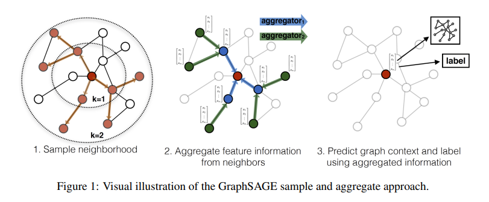
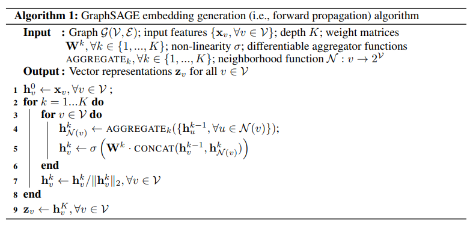

# 4. GraphSAGE

GCN是一种在图中结合拓扑结构和顶点属性信息学习顶点的embedding表示的方法。然而GCN要求在一个确定的图中去学习顶点的embedding，无法直接泛化到在训练过程没有出现过的顶点，即属于一种直推式(transductive)的学习。

GraphSAGE则是一种能够利用顶点的属性信息高效产生未知顶点embedding的一种归纳式(inductive)学习的框架。

其核心思想是通过学习一个对邻居顶点进行聚合表示的函数来产生目标顶点的embedding向量。

GraphSAGE 是Graph SAmple and aggreGatE的缩写，其运行流程如上图所示，可以分为三个步骤

1. 对图中每个顶点邻居顶点进行采样
2. 根据聚合函数聚合邻居结点蕴含的信息
3. 得到图中顶点的向量表示供下游任务

## 4.1 采样邻居节点

出于对计算效率的考虑，对每个顶点采样一定数量的邻居顶点作为待聚合信息的顶点。

设采样数量为k

- 若顶点邻居数少于k,则采用有放回的抽样方法，直到采样出k个顶点。

- 若顶点邻居数大于k，则采用无放回的抽样。

当然，若不考虑计算效率，我们完全可以对每个顶点利用其所有的邻居顶点进行信息聚合，这样是信息无损的。

## 4.2 生成向量的伪代码

GraphSAGE的前向传播算法如下，前向传播描述了如何使用聚合函数对节点的邻居信息进行聚合，从而生成节点embedding：

这里K是网络的层数，也代表着每个顶点能够聚合的邻接点的跳数，如K=2的时候每个顶点可以最多根据其2跳邻接点的信息学习其自身的embedding表示。
在每一层的循环k中，对每个顶点v，首先使用v的邻接点的k-1层的embedding表示来产生其邻居顶点的第k层聚合表示$h^k_{N(v)}$，之后将$h^k_{N(v)}$和顶点v的第k-1层表示进行拼接，经过一个非线性变换得到顶点v的第k层embedding表示$h^k_v$。

## 4.3 激活函数的选取

由于在图中顶点的邻居是天然无序的，所以我们希望构造出的聚合函数是对称的（即改变输入的顺序，函数的输出结果不变），同时具有较高的表达能力。

- MEAN aggregator

  $h_v^k\leftarrow\sigma(W\cdot MEAN(\{h^{k-1}_v\}\cup\{h_u^{k-1},\forall u\in N(v)\}))$

  上式对应于伪代码中的第4-5行，直接产生顶点的向量表示，而不是邻居顶点的向量表示。
  mean aggregator将目标顶点和邻居顶点的第k-1层向量拼接起来，然后对向量的每个维度进行求均值的操作，将得到的结果做一次非线性变换产生目标顶点的第k层表示向量。

- Pooling aggregator

  $AGGREGATE_k^{pool}=\max(\{\sigma(W_{pool}h_{u_i}^k+b),\forall u_i\in N(v)\})$

  Pooling aggregator 先对目标顶点的邻接点表示向量进行一次非线性变换，之后进行一次pooling操作(maxpooling or meanpooling)，将得到结果与目标顶点的表示向量拼接，最后再经过一次非线性变换得到目标顶点的第k层表示向量。

- LSTM aggregator

  LSTM相比简单的求平均操作具有更强的表达能力，然而由于LSTM函数不是关于输入对称的，所以在使用时需要对顶点的邻居进行一次乱序操作。

## 4.4 模型的迭代训练

在定义好聚合函数之后，接下来就是对函数中的参数进行学习。文章分别介绍了无监督学习和监督学习两种方式。

- 无监督学习形式

基于图的损失函数希望临近的顶点具有相似的向量表示，同时让分离的顶点的表示尽可能区分。目标函数如下：
$$
J_G(z_u)=-\log(\sigma(z_u^Tz_v))-Q\cdot E_{v_n\sim P_n(v)}\log(\sigma(-z_u^Tz_{v_n}))
$$
其中v是通过固定长度的随机游走出现在u附近的顶点，$p_n$是负采样概率分布，Q是负样本的数量。与DeepWalk不用的是，这里的顶点表示向量是通过聚合顶点的邻接点特征产生的，而不是简单的进行一个embedding lookup产生的。

- 监督学习形式

监督学习形式根据任务的不同直接设置目标函数即可，如最常用的节点分类任务使用交叉熵损失函数。