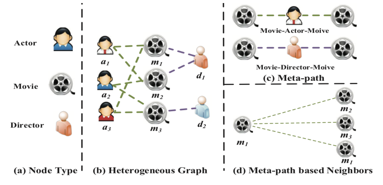
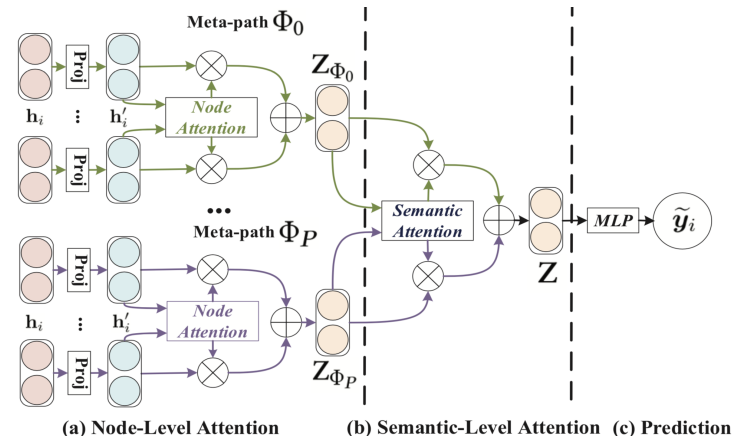
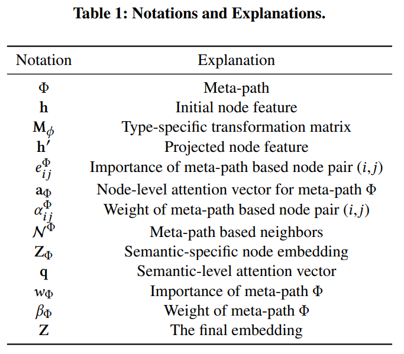
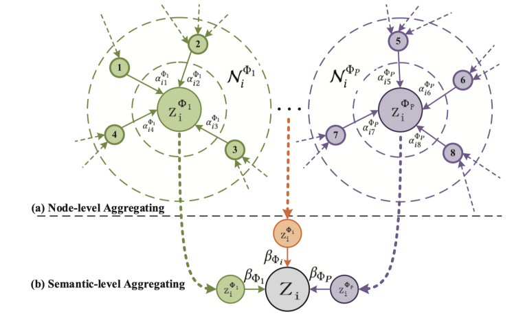
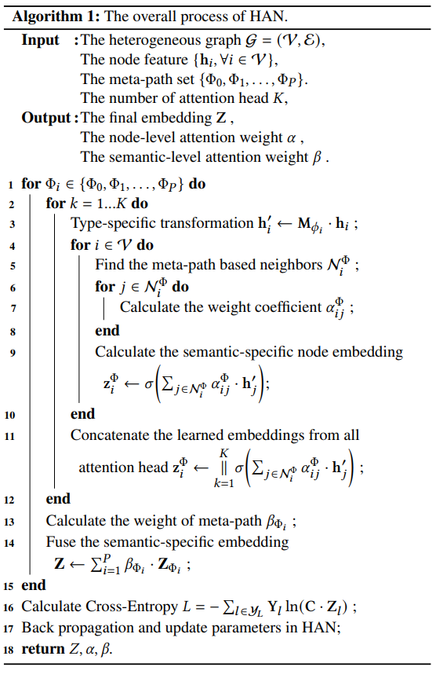

# 6. HAN

**HAN**是首次尝试研究**基于注意力机制**的**异构图神经网络**。将流行的**多头自注意力机制**用于异构图的元路径节点特征表示，然后通过语义级注意力加权汇总元路径注意力得到最终节点语义表示，其包含了节点特征和邻域结构特征。

## 6.1 异构图与元路径

元路径可以表示连接着的两个对象的复合关系，被广泛用于捕获语义的方法。我们以下图 IMDB 数据集为例：

IMDB 数据集中包括了演员、电影和导演三种不同类型的节点(a)，三者组成了一种拥有两种关系的异构网路图(b)，

在这个网络中我们可以获取两种元路径，包括可以反映共同出演关系的 Movie-Actor-Movie(MAM)和同一个导演关系的 Movie-Director-Movie(MDM)。

我们可以看到，每个元路径都具有着不同的语义。所以如果直接将传统的 GNN 应用于异构网络图的话会损失大量的信息。

基于以上分析，在设计异构神经网络时我们需要解决以下几种问题：

- 异构图：每个节点都具有着不同的属性，如何处理这种复杂的结构信息同时保留特征的多样性；
- 语义级注意力：不同元路径具有不同的语义信息，如何计算不同任务下这些元路径的重要性；
- 节点级注意力：元路径上节点有很多邻居，如何评估不同邻居的重要性。

针对以上问题，作者提出了异构图注意力网络(Heterogeneous graph Attention Network，以下简称 HAN)同时考虑了语义级注意力和节点级注意力。其大致流程如下：

- 首先利用特定类型的变换矩阵将不同节点的特征压缩到同一空间中；
- 然后基于节点级注意力学习同一路径中节点与其邻居的注意力分数，同时学习不同任务下不同元路径的语义级注意力分数；
- 最后基于节点级注意力分数和语义级注意力分数综合得到 Node Embedding。

## 6.2 HAN模型

HAN模型遵循一个层次注意力结构：节点级注意力→语义级注意力。

下图展示了HAN的整个框架。首先，我们提出节点级注意力来学习基于元路径的邻域的权值，并对其进行聚合得到语义特定的节点嵌入，然后，HAN通过语义级注意力来区分元路径的不同，从而得到特定任务的语义特定的节点嵌入的最优加权组合。

- 图2是HAN整个框架的示意图
- 图2-a（节点级注意力）：所有类型的节点都被投影到一个统一的特征空间中，通过节点级的注意力机制来学习基于meta-path的邻居节点的权重并将它们进行聚合得到特定语义的节点embedding。
- 图2-b（语义级注意力）：联合学习每个meta-path的权重，并通过语义级注意力融合前面得到的语义特定的节点embedding。
- 图2-c ：计算损失和对提出的HAN进行端到端的优化。

相关定义

### 节点级别注意力

给定某条元路径，我们可以利用节点级别注意力来学习特定语义下（Semantic-specific）的节点表示。我们首先将不同类型的节点属性通过投影矩阵变换到统一的属性空间。
$$
h^`_i=M_{\phi_i}\cdot h_i
$$
其中，$M_{\phi_i}$是投影矩阵，$h_i$和$h^`_i$分别是投影前后的节点特征。这里基于**自注意力机制（self-attention）**设计了节点级别注意力。具体来说，节点级别注意力将节点对的表示拼接起来并利用注意力向量来学习节点与其邻居间的重要性。
$$
e_{ij}^{\phi}=att_{node}(h^`_i,h^`_j;\phi)
$$

$$
\alpha_{ij}^{\phi}=softmax(e_{ij}^{\phi})=\frac{\exp(\sigma(a_{\phi}^T\cdot [h^`_i||h_j^`]))}{\sum_{k\in N_i^{\phi}}\exp(\sigma(a_{\phi}^T\cdot [h^`_i||h_k^`]))}
$$

其中，$\alpha_{ij}^{\phi}$是节点对 (i, j) 的注意力权重。注意这里的注意力是非对称的，这也符合图数据的实际特性。最后，通过节点级别的聚合操作（如图 3 (a) 所示）来学习 Semantic-specific 的节点表示。每个节点的表示都是由其邻居表示加权融合得到
$$
z_i^{\phi}=\sigma(\sum_{j\in N_i^{\phi}}\alpha_{ij}^{\phi}\cdot h^`_j)
$$
其中，$z_i^{\phi}$是节点在某条元路径下的表示。给定某条元路径，节点级别注意力可以学习到节点在某个语义下的表示。但是，在实际异质图中往往存在多条不同语义的元路径，单条元路径只能反映节点某一方面的信息。为了全面的描述节点，我们需要融合多条元路径的语义信息。

为了使训练过程更稳定，使用multi-head机制，即重复节点级attention K次，并将所学到的embeddings进行连接，形成特定语义的embedding：
$$
z_i^{\phi}=||^k_{k=1}\sigma(\sum_{j\in N_i^{\phi}}\alpha_{ij}^{\phi}\cdot h^`_j)
$$
给定meta-path集合{Φ0,Φ1,…,ΦP}，在进行节点级别attention之后，可以得到P组特定语义的节点embedding{Z1,Z2,...,Zp}。

### 语义级别注意力

给定元路径集合，节点级别注意力用来学习到不同语义下的节点表示。进一步，我们可以利用语义级别注意力来学习语义的重要性并融合多个语义下的节点表示。语义级别注意力的形式化描述如下：
$$
(\beta_{\phi_1}...,\beta_{\phi_p})=att_{sem}(Z_{\phi_1}...,Z_{\phi_p})
$$
其中，$(\beta_{\phi_1}...,\beta_{\phi_p})$是各个元路径的注意力权重。具体来说，我们利用单层神经网络和语义级别注意力向量来学习各个语义（元路径）的重要性并通过 softmax 来进行归一化。

为了学到每一个meta-path的重要性，使用一个线性转换（文中使用一层MLP）来转换特点语义的embedding。

文中将学到的特定语义的embeddings度量为使用一个语义级的attention向量q转换了的embedding的相似度：
$$
w_{\phi}=\frac{1}{|V|}\sum_{i\in V}q^T\cdot tanh(W\cdot z_i^{\phi}+b)
$$

$$
\beta_{\phi}=\frac{\exp(w_{\phi})}{\sum_{i=1}^p\exp(w_{\phi_i})}
$$

通过对多个语义进行加权融合（融合过程如图 3 (b) 所示），可以得到最终的节点表示。需要注意的是，这里的元路径权重是针对特定任务优化的。不同任务需要的语义信息不尽相同，元路径的加权组合形式也会有所差异
$$
z=\sum_{i=1}^p\beta_{\phi_i}\cdot Z_{\phi_i}
$$
最后，我们基于半监督的分类 loss 来优化整个模型
$$
L=-\sum_{l\in y_L}Y^`ln(C\cdot Z^l)
$$

- C表示分类器的参数
- y表示有标签的节点的索引
- Y表示有标签的节点的标签
- Z表示有标签的节点的embedding 

整个算法流程如下：

## 6.3 总结

异质图在真实世界无处不在，异质图的分析也是数据挖掘的热门方向。作者设计了一种异质图神经网络，同时在节点和语义级别利用注意力机制来对邻居信息和语义信息进行加权融合，进而学习到更加细致全面的节点表示。同时，通过对两层的注意力机制进行分析，所提模型具有较好的可解释性。

现实生活中，很多场景均可以被建模为异质图，如淘宝网就可以建模为用户，商品和商家交互的异质图。本文所提出的异质图注意力网络 HAN 具有广泛的适用性，可以根据不同场景（如商品推荐和异常账户检测）的需求设计不同的损失函数来学习节点表示。